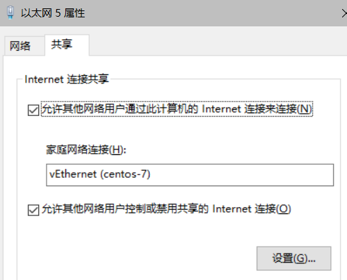

* 进入/etc/sysconfig/network-scripts目录
  * `cd  /etc/sysconfig/network-scripts`
  * `vi ifcfg-eth0`
* 配置以下信息
  * 这里把静态ip配置为192.168.137.200

    ```shell
    BOOTPROTO=static
    DEVICE=eth0
    ONBOOT=yes
    IPADDR=192.168.137.200
    GATEWAY=192.168.137.1
    DNS1=192.168.137.1
    NETMASK=255.255.255.0
    ```
  * 重启网络
    * `systemctl restart network`

* 打开Hyper-V上的虚拟机交换机管理器

  

* 新建虚拟网络交换机，输入名称，选择内部网络，点击确定

  

* 右键选中需要设置的虚拟机的设置选项，弹出如下框，选择刚才新建的Centos-7的虚拟交换机，点击确定，之后便可重启虚拟机使之生效

  

* 物理机上面的网络设置，我本机使用的是win10，打开控制面板->网络和共享中心->更改适配器设置：找到刚刚在hyper-v上新增的虚拟网络交换机，右键选择属性 --> 选择如下IPv4协议

* 设置如下IP地址和子网掩码，其他可留空，IP地址必须是192.168.X.1的设置，这里的X=137是刚才我们在centos7上设置的网段，需保持一致

    

* 这时虚拟机的静态ip就已经配置好了,本地机器已经可以链接虚拟机了,但虚拟机不能访问外网

* 在`控制面板->网络和共享中心->更改适配器设置`中选择物理机正在使用的网卡右键属性点击共享选项进行配置

    

* 到此虚拟机的静态ip已经配置完成
