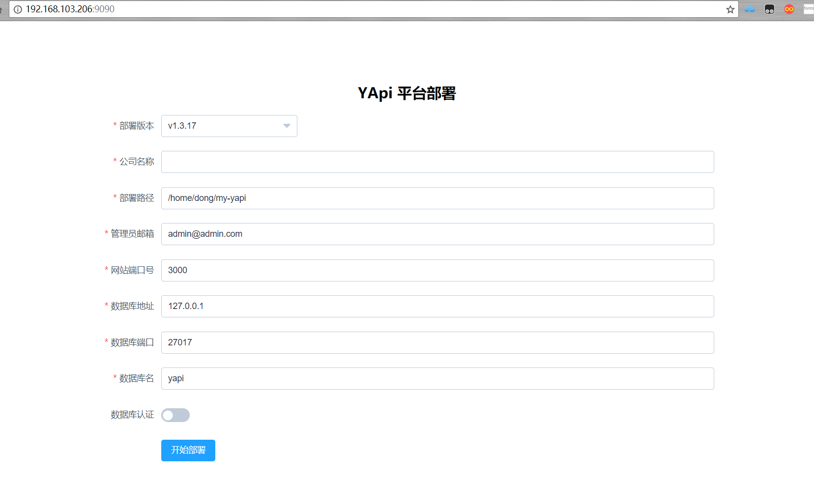
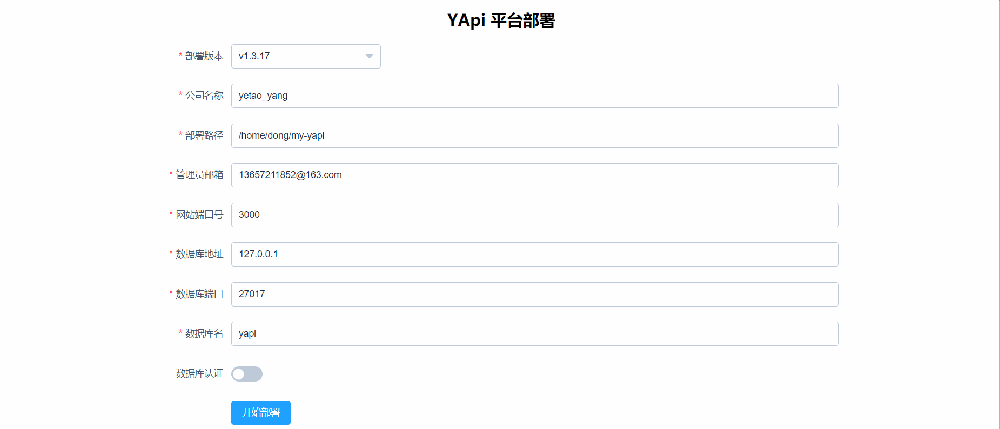
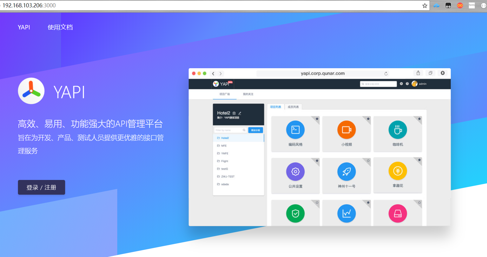

#### Yapi

### 介绍


### 内网部署

>环境要求:
> * `nodejs（7.6+)`
> * `mongodb（2.6+）`
> * `git`

### node.js安装

>Node.js v9.x安装命令
* `curl --silent --location https://rpm.nodesource.com/setup_9.x | bash -`

>yum安装node.js
* `yum install -y nodejs`

>node.js版本管理器n
* `npm install -g n`

>安装稳定版本
* `n stable`

>查看版本
* `node -v`
  ```
  	v9.8.0
  ```
### MongoDB安装

* 创建仓库
  * `vi /etc/yum.repos.d/mongodb-org-3.4.repo`
  * 把下面的内容复制到文件中 保存退出
    ```
    [mongodb-org-3.4]
name=MongoDB Repository
baseurl=https://repo.mongodb.org/yum/redhat/$releasever/mongodb-org/3.4/x86_64/
gpgcheck=1
enabled=1
gpgkey=https://www.mongodb.org/static/pgp/server-3.4.asc
    ```
* yum安装
  * `yum install -y mongodb-org`
* 修改配置文件
  * `vi /etc/mongod.conf`
  * 把bindIP改成 0.0.0.0所有的机器都可以访问

> * `systemctl start mongod.service`
> * `systemctl stop mongod.service` //停止
> * `systemctl restart mongod.service` //重启
> * `systemctl enable mongod` //设置开机自启

### Yapi 可视化部署

* `npm install -g yapi-cli --registry https://registry.npm.taobao.org`
*  `yapi server`
  ```
  [root@localhost dong]# yapi server                
  在浏览器打开 http://0.0.0.0:9090 访问。非本地服务器，请将 0.0.0.0 替换成指定的域名或ip
  ```
* 配置界面





* 启动
  * `node vendors/server/app.js`
  * `http://xxx.xxx.xx.xx:3000`

    

* 登录
