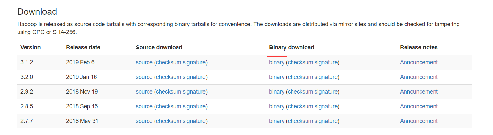

# hadoop的部署

> 软件配置简览

| 名称 | 版本 |
| - | - |
| centos|7.6.1810|
|java|1.8.0_201-b09|
|hadoop|2.9.2|


> 在[hadoop](https://hadoop.apache.org/releases.html)官网下载对应的版本



> 具体centos集群配置如下<br/>
> **`三台机器均以配置静态IP 并互相可以免密登录`**

| 主机IP | 主机名 |
| - | - |
| 192.168.137.200 | hadoop01 |
| 192.168.137.201 | hadoop02 |
| 192.168.137.202 | hadoop03 |

* **在需要安装hadoop的位置建立hadoop的文件夹**
  * **这里新建的hadoop的文件夹路径为`/home/yetao_yang/hadoop`**
  * 在hadoop的目录里新建`binary`文件夹并把hadoop的安装包放入到此文件夹中
    ```shell
    [yetao_yang@hadoop02 binary]$ ll
    总用量 0
    drwxr-xr-x. 10 yetao_yang yetao_yang 161 2月  15 14:28 hadoop-2.9.2
    ```
  * 在hadoop文件夹类新建以下文件夹
    * `dfs` `tmp` `var`
    * 在`dfs`目录下新建`data`和`name`两个文件夹
    * 具体的目录结构如下

      ```
      ->hadoop
          -> binary
          -> dfs
            -> data
            -> name
          -> tmp
          -> var
      ```

#### 修改`hadoop/binary/hadoop-2.9.2/etc/hadoop`文件夹下的一系列配置文件

* 修改`core-site.xml`文件
  * 在`<configuration>`节点内加入配置:

    ```xml

    <property>
      <name>hadoop.tmp.dir</name>
      <value>/home/yetao_yang/hadoop/tmp</value>
      <description>Abase for other temporary directories.</description>
    </property>

    <property>
      <name>fs.default.name</name>
      <value>hdfs://hadoop01:9000</value>
    </property>

    ```

* 修改`hadoop-env.sh`文件
  * 修改JAVA_HOME的路径
    * `export JAVA_HOME=/usr/local/jdk1.8.0_201`
  * 修改hadoop配置文件路径
    * `export HADOOP_CONF_DIR=/home/yetao_yang/hadoop/binary/hadoop-2.9.2/etc/hadoop`
  * 退出修改 并使环境变量生效
    * `source  /home/yetao_yang/hadoop/binary/hadoop-2.9.0/etc/hadoop/hadoop-env.sh`

* 修改`hdfs-site.xml`文件
  * 在`<configuration>`节点内加入配置:

    ```xml

    <property>
      <name>dfs.name.dir</name>
      <value>/home/yetao_yang/hadoop/dfs/name</value>
      <description>Path on the local filesystem where theNameNode stores the namespace and transactions logs persistently.</description>
    </property>

    <property>
      <name>dfs.data.dir</name>
      <value>/home/yetao_yang/hadoop/dfs/data</value>
      <description>Comma separated list of paths on the localfilesystem of a DataNode where it should store its blocks.</description>
    </property>

    <property>
      <name>dfs.replication</name>
      <value>2</value>
    </property>

    <property>
      <name>dfs.permissions</name>
      <value>false</value>
      <description>need not permissions</description>
    </property>

    ```

* 把`mapred-site.xml.template`文件复制为`mapred-site.xml`
  * 修改`mapred-site.xml`文件
  * 在`<configuration>`节点加入配置

    ```xml

    <property>
       <name>mapred.job.tracker</name>
       <value>hadoop01:49001</value>
    </property>

    <property>
          <name>mapred.local.dir</name>
           <value>/home/yetao_yang/hadoop/var</value>
    </property>

    <property>
       <name>mapreduce.framework.name</name>
       <value>yarn</value>
    </property>

    ```

* 修改`slaves`文件
  * 把里面的localhost删除掉并添加两个hadoop从节点的主机名

    ```shell

    hadoop02
    hadoop03

    ```

* 修改`yarn-site.xml`文件
  * 在`<configuration>`节点加入配置

    ```xml

    <property>
      <name>yarn.resourcemanager.hostname</name>
      <value>hadoop01</value>
    </property>

    <property>
      <description>The address of the applications manager interface in the RM.</description>
      <name>yarn.resourcemanager.address</name>
      <value>${yarn.resourcemanager.hostname}:8032</value>
    </property>

    <property>
      <description>The address of the scheduler interface.</description>
      <name>yarn.resourcemanager.scheduler.address</name>
      <value>${yarn.resourcemanager.hostname}:8030</value>
    </property>

    <property>
      <description>The http address of the RM web application.</description>
      <name>yarn.resourcemanager.webapp.address</name>
      <value>${yarn.resourcemanager.hostname}:8088</value>
    </property>

    <property>
      <description>The https adddress of the RM web application.</description>
      <name>yarn.resourcemanager.webapp.https.address</name>
      <value>${yarn.resourcemanager.hostname}:8090</value>
    </property>

    <property>
      <name>yarn.resourcemanager.resource-tracker.address</name>
      <value>${yarn.resourcemanager.hostname}:8031</value>
    </property>

    <property>
      <description>The address of the RM admin interface.</description>
      <name>yarn.resourcemanager.admin.address</name>
      <value>${yarn.resourcemanager.hostname}:8033</value>
    </property>

    <property>
      <name>yarn.nodemanager.aux-services</name>
      <value>mapreduce_shuffle</value>
    </property>

    <property>
      <name>yarn.scheduler.maximum-allocation-mb</name>
      <value>2048</value>
      <discription>每个节点可用内存,单位MB,默认8182MB</discription>
    </property>

    <property>
      <name>yarn.nodemanager.vmem-pmem-ratio</name>
      <value>2.1</value>
    </property>

    <property>
      <name>yarn.nodemanager.resource.memory-mb</name>
      <value>2048</value>
    </property>

    <property>
      <name>yarn.nodemanager.vmem-check-enabled</name>
      <value>false</value>
    </property>

    ```

* 把配置好的`/home/yetao_yang/hadoop`文件进行打包
  * `tar -zcvf hadoop.tar.gz /home/yetao_yang/hadoop`
* 上传`hadoop.tar.gz`压缩包到其它的主机
  * `scp /home/yetao_yang/hadoop.tar.gz yetao_yang@hadoop02:/home/yetao_yang`
    * 把`hadoop.tar.gz`文件传输到`yetao_yang@hadoop02`的`/home/yetao_yang`目录下

* 启动hadoop
  * 在主节点进入`/home/yetao_yang/hadoop/binary/hadoop-2.9.2/bin`执行初始化代码
    * `./hadoop  namenode  -format`
  * 在主节点进入`/home/yetao_yang/hadoop/binary/hadoop-2.9.2/sbin`执行启动代码
    * `./start-all.sh`

      ```
      [yetao_yang@hadoop01 sbin]$ ./start-all.sh
      This script is Deprecated. Instead use start-dfs.sh and start-yarn.sh
      Starting namenodes on [hadoop01]
      hadoop01: starting namenode, logging to /home/yetao_yang/hadoop/binary/hadoop-2.9.2/logs/hadoop-yetao_yang-namenode-hadoop01.out
      hadoop03: starting datanode, logging to /home/yetao_yang/hadoop/binary/hadoop-2.9.2/logs/hadoop-yetao_yang-datanode-hadoop03.out
      hadoop02: starting datanode, logging to /home/yetao_yang/hadoop/binary/hadoop-2.9.2/logs/hadoop-yetao_yang-datanode-hadoop02.out
      Starting secondary namenodes [0.0.0.0]
      0.0.0.0: starting secondarynamenode, logging to /home/yetao_yang/hadoop/binary/hadoop-2.9.2/logs/hadoop-yetao_yang-secondarynamenode-hadoop01.out
      starting yarn daemons
      starting resourcemanager, logging to /home/yetao_yang/hadoop/binary/hadoop-2.9.2/logs/yarn-yetao_yang-resourcemanager-hadoop01.out
      hadoop02: starting nodemanager, logging to /home/yetao_yang/hadoop/binary/hadoop-2.9.2/logs/yarn-yetao_yang-nodemanager-hadoop02.out
      hadoop03: starting nodemanager, logging to /home/yetao_yang/hadoop/binary/hadoop-2.9.2/logs/yarn-yetao_yang-nodemanager-hadoop03.out
      
      ```

* `http://mastIP:50070`
* `http://mastIP:8088`
