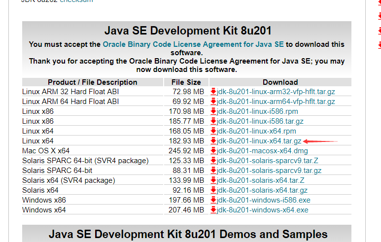

# java8安装
> 去[官网](https://www.oracle.com/technetwork/java/javase/downloads/jdk8-downloads-2133151.html)下载要安装的版本

* 解压文件,并移动到要安装的目录
  * 我的是放在了`/usr/local/`下
* 配置环境变量
  * `vi /etc/profile`
  * 在文件末尾添加如下配置
    * `export JAVA_HOME=/usr/local/jdk1.8.0_201`
    * `export CLASSPATH=.:${JAVA_HOME}/jre/lib/rt.jar:${JAVA_HOME}/lib/dt.jar:${JAVA_HOME}/lib/tools.jar`
    * `export PATH=$PATH:${JAVA_HOME}/bin`
* 重新加载`/etc/profile`文件
  * `source /etc/profile`
* 输入`java -version`查看java版本的信息
