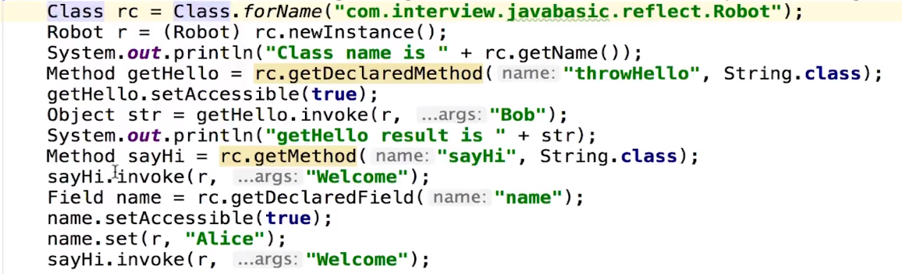

> 谈谈java的理解

* 平台无关性(跨平台)
* 面对对象
* GC
* 类库
* 语言特性
* 异常处理

> JVM如何加载.class文件
> 通过classLoad

> 反射

> JVM三大性能调优参数-Xms -Xmx -Xss的含义

* `java -Xms128m -Xmx128m -Xss256k -jar xxxx.jar`
  * -Xss:规定了每个线程虚拟机栈(堆栈)的大小
  * -Xms:堆的初始值
  * -Xmx:堆能达到的最大值

> 堆和栈的区别

* 管理方式: 栈自动释放,堆需要GC
* 空间大小:栈比较小
* 碎片相关:栈产生的碎片远小于堆
* 分配方式:栈支持静态和动态分配,而堆仅支持动态分配
* 效率: 栈的效率比堆高(因为内存基础本身就采用了栈结构)
