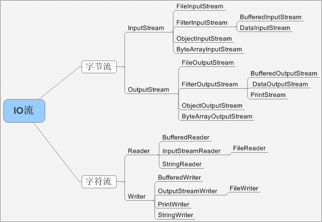

> 谈谈java的理解

* 平台无关性(跨平台)
* 面对对象
* GC
* 类库
* 语言特性
* 异常处理

> java的三大特性

> JVM如何加载.class文件
> 通过classLoad

> 反射

> JVM三大性能调优参数-Xms -Xmx -Xss的含义

* `java -Xms128m -Xmx128m -Xss256k -jar xxxx.jar`
  * -Xss:规定了每个线程虚拟机栈(堆栈)的大小
  * -Xms:堆的初始值
  * -Xmx:堆能达到的最大值

# JVM

> 堆和栈的区别

* 管理方式: 栈自动释放,堆需要GC
* 空间大小:栈比较小
* 碎片相关:栈产生的碎片远小于堆
* 分配方式:栈支持静态和动态分配,而堆仅支持动态分配
* 效率: 栈的效率比堆高(因为内存基础本身就采用了栈结构)

> jvm堆模型

* 主要单词
  * eden`eden:伊甸园`
  * survivor`sərˈvīvər:幸存者`
  * Young Gen`新生代`
  * Old Memory`老年代`
  * Minor GC`ˈmīnər:触发新生代的GC`
  * Major GC`ˈmājər:触发老年代的GC`

* 首先创建的对象都会放到eden和survivor1中,survivor2为备用
* eden区域满了,就会触发minor gc操作,将会回收新生代中不再被使用的对象.此时,eden和survivor1中存活的对象移入survivor2中
* 移动完成后,eden和survivor1中就剩余不用的对象,minor gc将会移除他们
* 移除后survivor1和survivor2的角色互换,survivor1将作为备用
* 如果一个对象在新生代多次minor gc都还存活(默认15次),说明他是长时间存活对象,将会移动到老年代
* 在minor gc 发生的时候,将存活的对象放到备用的survivor中,如果survivor放满了就会放到老年代
* 所以在老年代中存放的就会有短时间存活的现象,然后老年代就会很快满,然后触发full gc
* full gc频繁发生将会导致程序的等待,甚至超时退出

> java

> 动态对象分配规则

> jvm内存结构

> 类的生命周期

> 类加载器

* 启动类加载器:Bootstrap ClassLoader，负责加载存放在JDK\jre\lib(JDK代表JDK的安装目录，下同)下，或被-Xbootclasspath参数指定的路径中的，并且能被虚拟机识别的类库
* 扩展类加载器：Extension ClassLoader，该加载器由sun.misc.Launcher$ExtClassLoader实现，它负责加载DK\jre\lib\ext目录中，或者由java.ext.dirs系统变量指定的路径中的所有类库（如javax.xx开头的类），开发者可以直接使用扩展类加载器。
* 应用程序类加载器：Application ClassLoader，该类加载器由sun.misc.Launcher$AppClassLoader来实现，它负责加载用户类路径（ClassPath）所指定的类，开发者可以直接使用该类加载器

* 类的加载机制
  * 全盘负责，当一个类加载器负责加载某个Class时，该Class所依赖的和引用的其他Class也将由该类加载器负责载入，除非显示使用另外一个类加载器来载入
  * 父类委托(双亲委派机制)，先让父类加载器试图加载该类，只有在父类加载器无法加载该类时才尝试从自己的类路径中加载该类
  * 缓存机制，缓存机制将会保证所有加载过的Class都会被缓存，当程序中需要使用某个Class时，类加载器先从缓存区寻找该Class，只有缓存区不存在，系统才会读取该类对应的二进制数据，并将其转换成Class对象，存入缓存区。这就是为什么修改了Class后，必须重启JVM，程序的修改才会生效

> 异常处理

* throws是用来声明一个方法可能抛出的所有异常信息，throws是将异常声明但是不处理，而是将异常往上传，谁调用我就交给谁处理。而throw则是指抛出的一个具体的异常类型。

> Collection的关系

> HashMap和Hashtable的区别

* hashMap的默认长度为16,每次扩容都会把size的大小*2,相当于把大小左移1`<<1`

* java IO结构

> spring IOC 控制反转

* IoC（控制反转）,将类的创建和依赖关系写在配置文件里，由配置文件注入，实现了松耦合

> AOP 面向切面

* AOP（面向切面）,将安全，事务等于程序逻辑相对独立的功能抽取出来，利用spring的配置文件将这些功能插进去，实现了按照方面编程，提高了复用性

> spring Bean的生命周期

