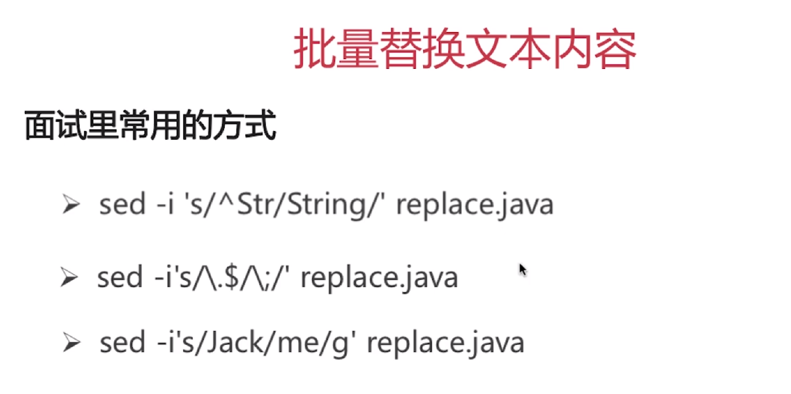
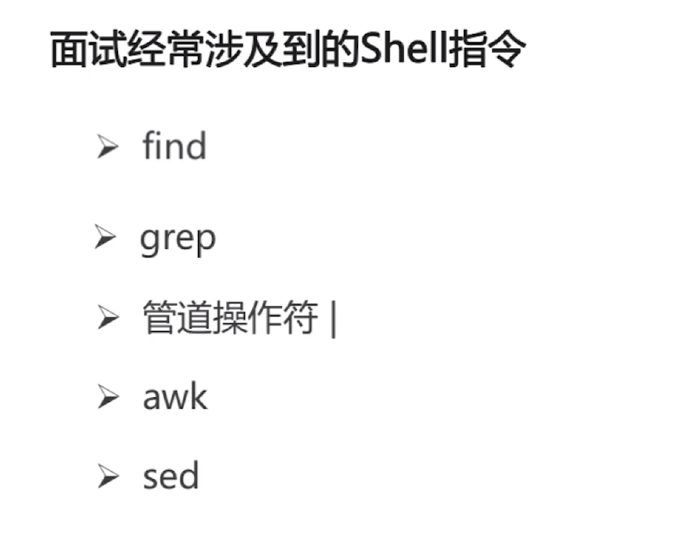

* 找到某个文件
  * find path [options] params
    * `find -name "xxx.java"`
      * 在当前目录下查找某个文件
    * `find / -name "xxx.java"`
      * 在跟目录进行查找**全局搜索**
    * `find ~ -name "aa*"`
      * 查找以aa开头的文件**~为当前用户的跟目录**
    * `find ~ -iname "aa*"`
      * 查找以aa开头的文件(忽略大小写)**~为当前用户的跟目录**

* 检索文件内容
  * `grep "AA" file*`
    * 显示以file开头并包含AA的内容(只显示一行)

> 其它

