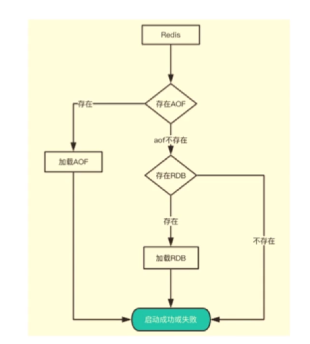
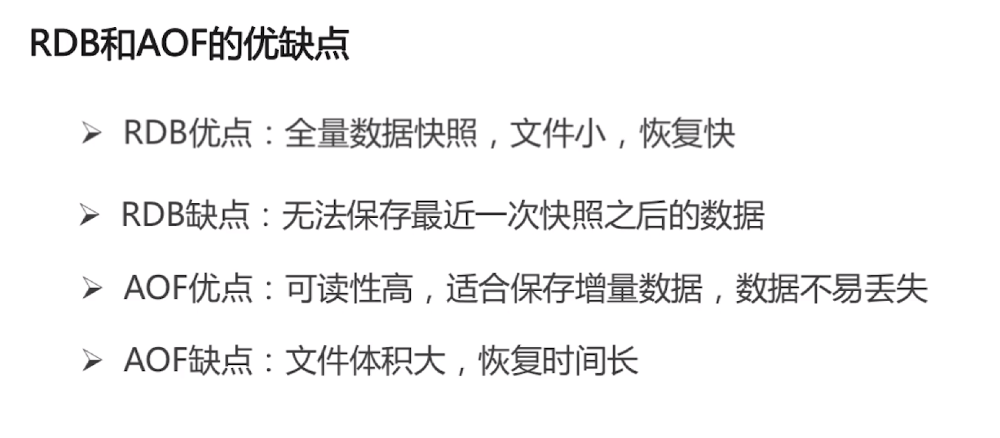
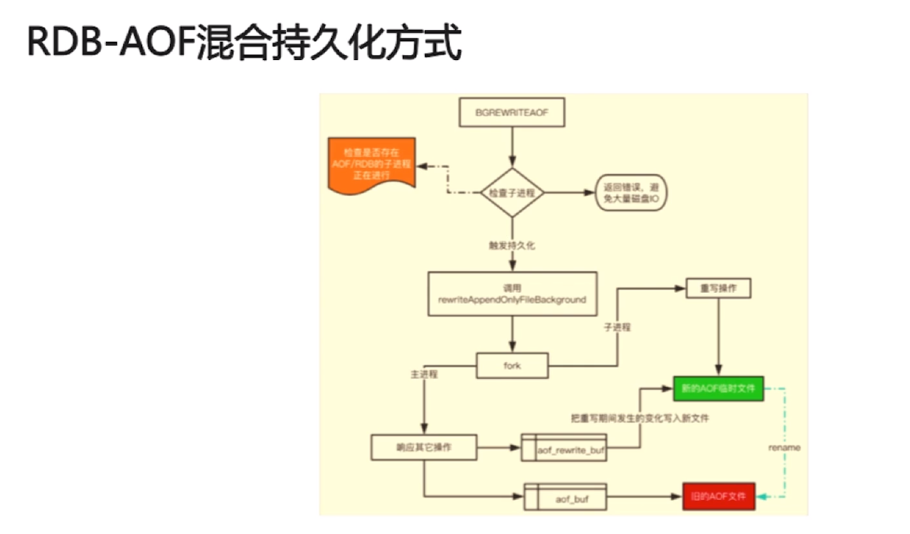
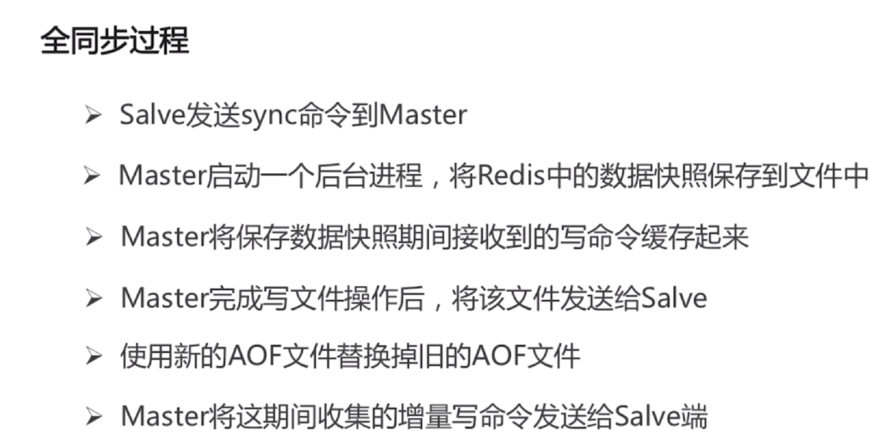
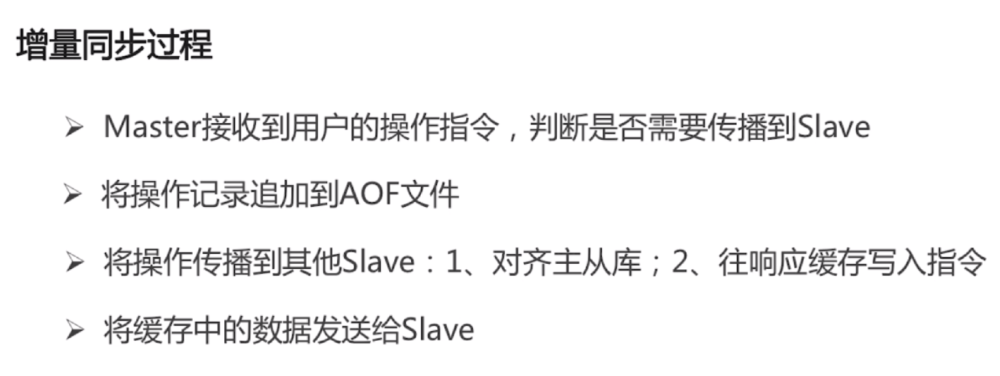

# redis

* redis的数据类型
  * String: 最基本的数据类型,二进制安全
  * Hash: String元素组成的字典,适合用于存储对象
  * List: 列表,按照String元素插入顺序排序(后进先出)
  * Set: String元素组成的无序集合,通过Hash表实现,不允许重复
  * Sorted Set: 通过分数来为集合中的成员进行从大到小的排序


* 从海量Key里面查询出某一固定前缀的Key
  * scan 0 match k1* count 10
    * 游标为0 取十个以k1开头的key

> 如何实现分布式锁

* `SET key value [EX seconds] [PX milliseconds] [NX|XX]`
  * `EX seconds`设置键的过期时间为seconds秒
  * `PX milliseconds`设置键的过期时间为milliseconds毫秒
  * `NX`只在键不存在时才对键进行设置操作
  * `XX`只在键存在时才对建进行设置操作
  * **SET操作成功完成时,返回OK,否则返回nil**
* 指令具体写法如下
  * `set locktarget 12345 ex 10 nx`

> redis的持久化

### RDB快照方式进行持久化
* 在redis.conf的文件中配置`默认为下`

  ```shell
  save 900 1 #900秒有1条数据变动就进行快照
  save 300 10 #300秒有10条数据变动进行快照
  save 60 10000 #60秒有10000条数据变动进行快照
  save "" #如果进行该设置表示禁用rdb方案备份
  stop-writes-on-bgsave-error yes #当备份进程出错时,主进程就停止写入操作
  rdbcompression yes #把备份文件进行压缩,再备份 建议设计成no,redis为CPU密集型服务器,开启压缩后会带来更多的cpu的消耗
  #具体配置可根据实际场景进行调整
  ```
### AOF指令方式进行持久化
* 在redis.conf的文件中配置
  * AOF方式是写指令的保存方式,会尽可能的保存数据的无损
  * `appendonly yes`开启AOF备份
  ```shell
  appendonly yes
  # appendfsync always #一旦缓存区的内容发生变化,就把内容写入到AOF
  appendfsync everysec #每隔一秒写入到AOF文件中(默认)
  # appendfsync no     #由操作系统判断何时写入AOF
  ```
* 当进行的操作越来越多AOF会保存大量无用的AOF指令,文件会越来越大

* 日志重写解决AOF文件大小不断增大的问题,原理如下:
  * 调用fork(),创建一个子进程
  * 子进程把新的AOF写到一个临时文件里,不依赖原来的AOF文件
  * 主进程持续将新的变动同时写到内存和原来的AOF里
  * 主进程获取子进程重写AOF的完成信号,往新AOF同步增量变动
  * 使用新的AOF文件替换掉旧的AOF文件

> redis的启动流程





> redis混合持久化的流程



> redis的同步机制




