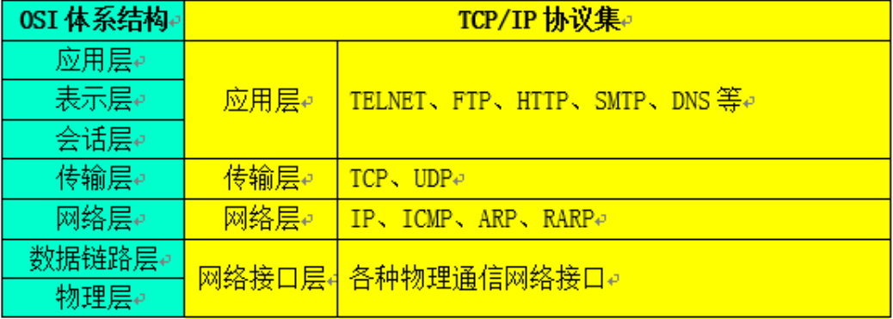
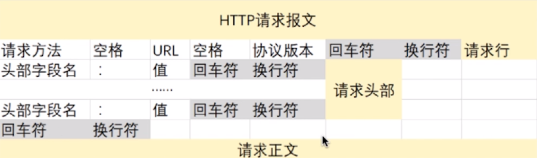
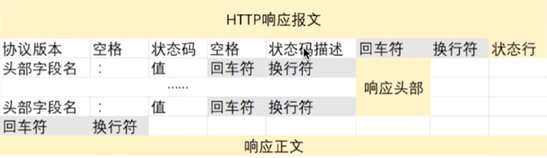
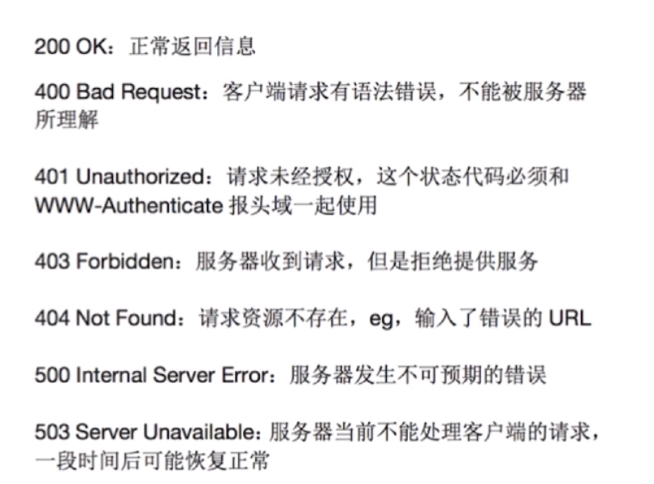
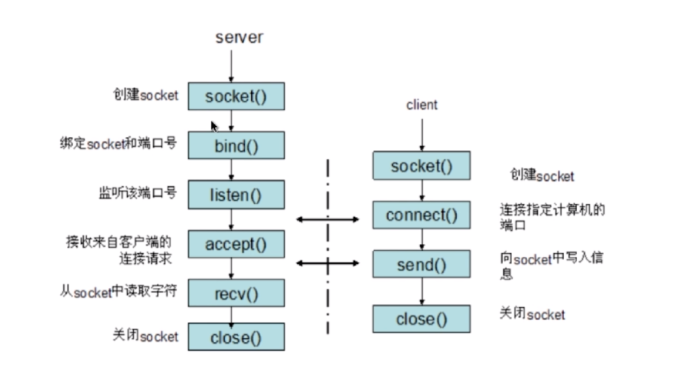

# 网络基础考点

> OSI七层协议

| 层级 | 名称 | 简介 |
| :-: | - | - |
| 第七层 | 应用层 | 为应用提供服务 |
| 第六层 | 表示层 | 信息语法的定义以及他们的关联,如加密解密,转换翻译,压缩解压 |
| 第五层 | 会话层 | 不同机器上的用户之间建立及管理回话 |
| 第四层 | 传输层 | 解决了数据间的传输,解决了传输质量的问题,可以将大数据分割成多个小的数据 |
| 第三层 | 网络层 | 将网络地址翻译成对应的物理地址并决定将数据从发送方路由到接收方 |
| 第二层 | 数据链路层 | 物理选址,同时将原始比特流转变为逻辑传输线路 |
| 第一层 | 物理层 | 定义了物理设备的标准如:网线的类型光纤的接口类型等 |

> OSI的实现**TCP/IP**

> TCP的三次握手

* 在TCP/IP协议中,TCP协议提供可靠的链接服务,采用三次握手建立一个链接
  * 第一次握手: 建立链接时,客户端发送SYN包[syn=j]到服务器,并进入SYN_SEND状态,等待服务器的确认
  * 第二次握手: 服务器收到SYN包,必须确认客户的SYN(ack=j+1),同时自己也发送一个SYN包(syn=k),即SYN+ACK包,此时服务器进入SYN_RECV状态
  * 第三次握手: 客户端收到服务器的SYN+ACK包,向服务器发送确认包ACK[ack=k+1],此时发送完毕,客户端和服务器进入ESTABLISHED状态,完成三次握手

> TCP的四次挥手

* TCP采用四次挥手来释放链接
  * 第一次挥手: Client发送一个FIN,用来关闭Client到Server的数据传送,Client进入FIN_WAIT_1的状态
  * 第二次挥手: Server收到FIN后,发送一个ACK给Client,确认序列号为收到序列号+1,Server进入CLOSE_WAIT状态
  * 第三次挥手: Server发送一个FIN,用来关闭Server到Client的数据传送,Server进入LAST_ACK状态
  * 第四次挥手: Client收到FIN后,Client进入TIME_WAIT状态,接着发送一个ACK给Server,确认序号为收到序号+1,Server进入CLOSE状态,完成四次挥手

> TCP和UDP的区别

* TCP面向连接,UDP无连接(没有三次握手和四次挥手)
* TCP可靠,UDP不可靠
* TCP具备有序性,UDP不具备有序性
* TCP速度比较慢,UDP速度比较快
* TCP属于重量级的,UDP是轻量级的

> TCP的滑动窗口

* 提供TCP的可靠性
* 保证TCP的流控特性
* 只有当前面ACK序号接收到回传,才会发送后面序号的报文,即进行滑动

> HTTP

* 支持客户/服务器模式
* 简单快速
* 灵活
* 无连接(请求后连接关闭)
* 无状态协议

> HTTP请求结构

> HTTP响应结构

> 当浏览器输入地址按下回车都发生了哪些

* DNS解析(根据域名得到ip地址与端口号)
* TCP连接(三次握手)
* 发送HTTP请求
* 服务器处理请求并返回报文
* 浏览器渲染页面
* 结束连接(四次挥手)

> HTTP常用状态码

* 1xx -> 指示信息-表示请求已接收,继续处理
* 2xx -> 成功-表示请求已被接收,理解,接受
* 3xx -> 重定向-要求请求必须进行进一步的操作
* 4xx -> 客户端的错误-请求有语法或请求无法实现
* 5xx -> 服务端的错误

> GET请求与POST请求的区别

* HTTP报文层面: GET请求将信息放在了URL(参数有长度限制:根据不同浏览器而定);POST请求放在了报文中
* 数据库方面: GET请求符合幂等性与安全性,POST不符合
* 其它层面: GET请求可以被缓存,POST请求不行

> Cookie和Session的区别

* Cookie数据存放在客户端上,Session数据存放在服务器上
* Session相较于Cookie更安全
* 若Session较多会加大服务器的负担,应考虑使用Cookie

> HTTP与HTTPS的区别

* HTTPS需要CA整数
* HTTPS密文传输,HTTP明文传输
* HTTPS默认443端口,HTTP默认80端口
* HTTPS = HTTP + 加密 + 认证 + 完整性保护, 较HTTP安全

> Socket通信流程

