# EureKa
>* 服务的注册与发现
>* 基于NetFlix EureKa 做了二次封装
>* 分为 `EureKa服务端(EureKa Server)` 与 `EureKa客户端(EureKa Client)`

### 注册中心`EureKa Server`
```
记录着应用叫什么名字
在哪台服务器上
检查应用是否健康(判断应用是否要从注册中心剔除)
```
* 供服务注册的服务器
* 所有模块要到这里注册
* 让所有模块维持心跳链接(默认30秒检查注册中心的所有模块是否可用)用来检测系统中各个微服务是否正常运行


### 服务中心`EureKa Client`
* 简化与服务器的交互
* 作为轮循负载均衡器
* 提供服务的故障切换

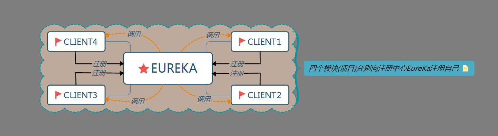

### 建立注册中心应用
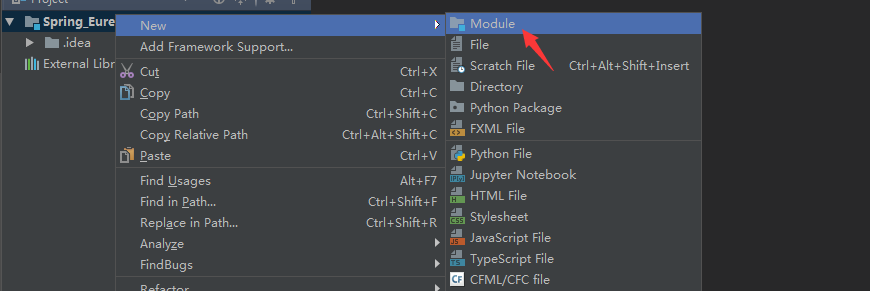

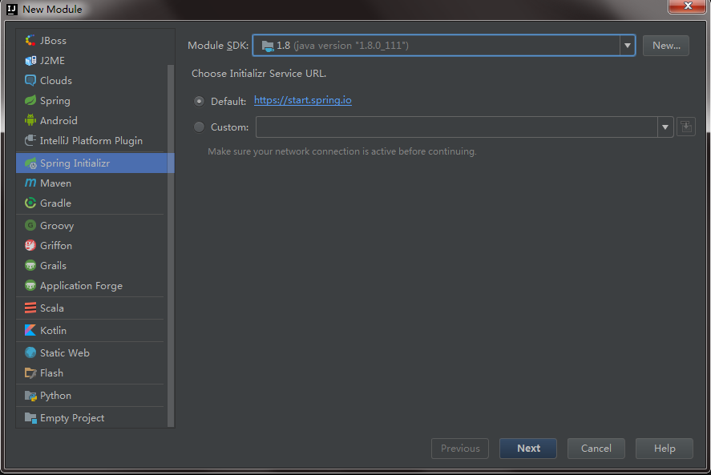

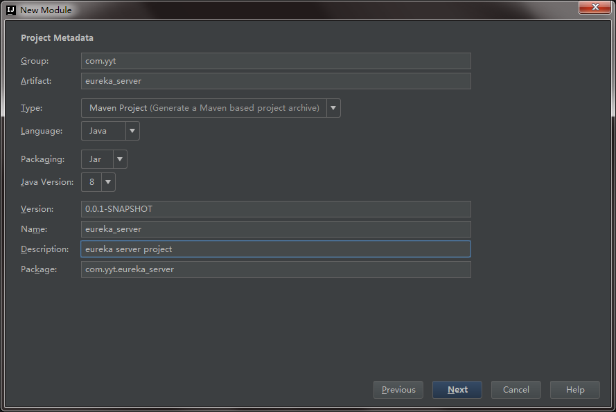

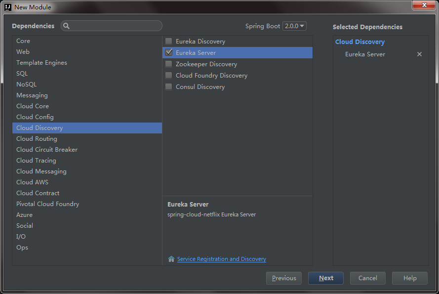

>点击完成

* 项目建城后查看`spring cloud` 版本是否与`spring boot`版本是否与[spring官网](https://projects.spring.io/spring-cloud/)相对应
  * pom文件

    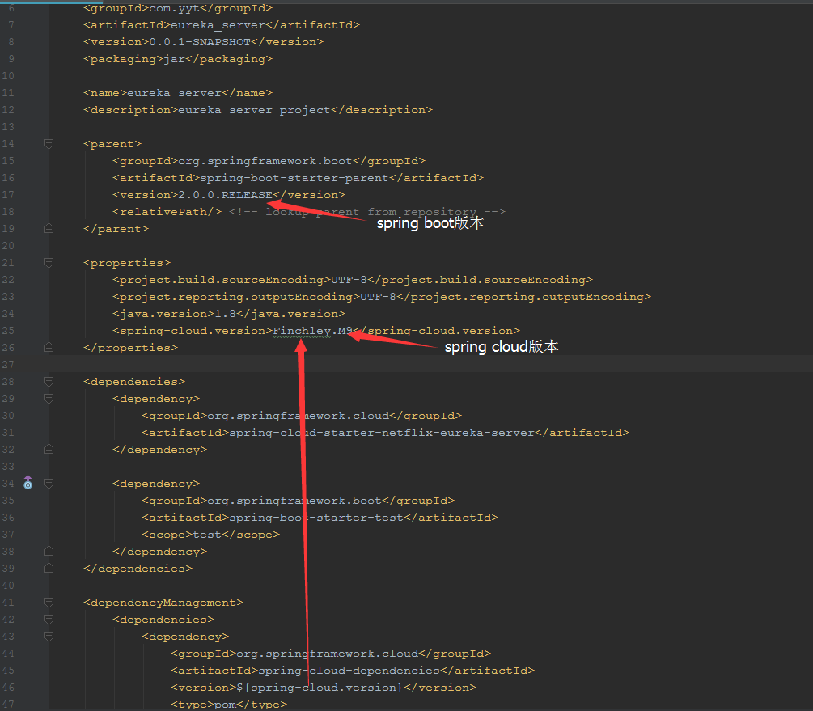

  * spring官网版本依赖关系

    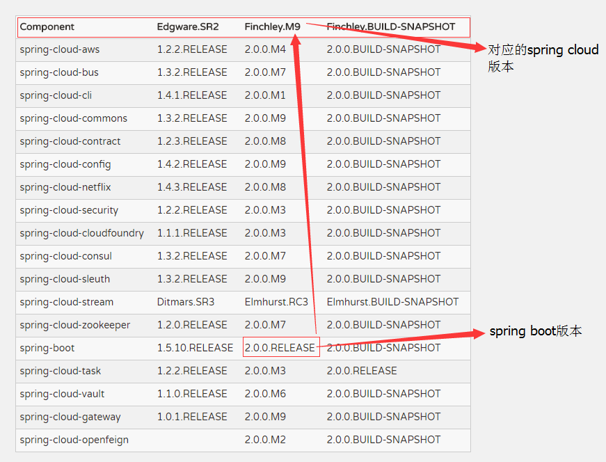

    > 版本号依赖是对的
* 在启动主类上加上`@EnableEurekaServer`注解
* eureka虽然是注册中心,但也要把自己注册到注册中心取,即自己注册自己
* 新建一个配置文件`application-eureka.yml`写入以下配置

  ```yml
  eureka:
    client:
      service-url:
        #eureka的服务地址(端口号要与应用端口号一致)
        defaultZone: http://localhost:8761/eureka
      #因为是注册中心所以没必要出现在控制页面
      register-with-eureka: false
    server:
      #开发环境关闭,正式环境设置为true
      enable-self-preservation: false
  ```
* 然后再主配置文件里面加载该配置

  ```yml
  server:
    #该应用的启动端口号
    port: 8761
  spring:
    application:
      #应用名称
      name: eureka
    profiles:
      #要加载的配置文件
      active: eureka

  ```
* 启动项目发现会报如下错误

  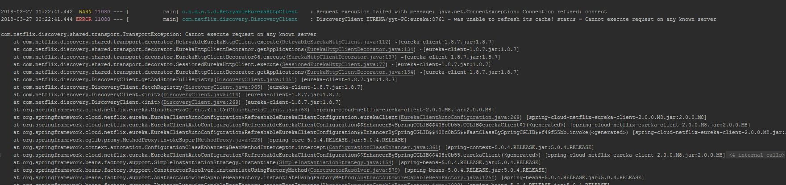

  * 原因是注册中心自己注册了自己,当注册中心启动时,会检查配置的服务加载进来没有,这时注册中心自己的服务还没有加载进来所以会报错(eureka采用的是心跳监测,所以当注册中心全部加载完毕后,再进行监测会把自己加载进去,所以要解决的是要忽略这个错误)

* 浏览器输入地址会看到如下界面

  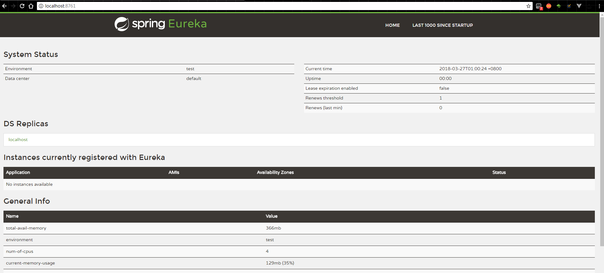

### 建立服务中心应用


**还要选择web  导入web依赖**
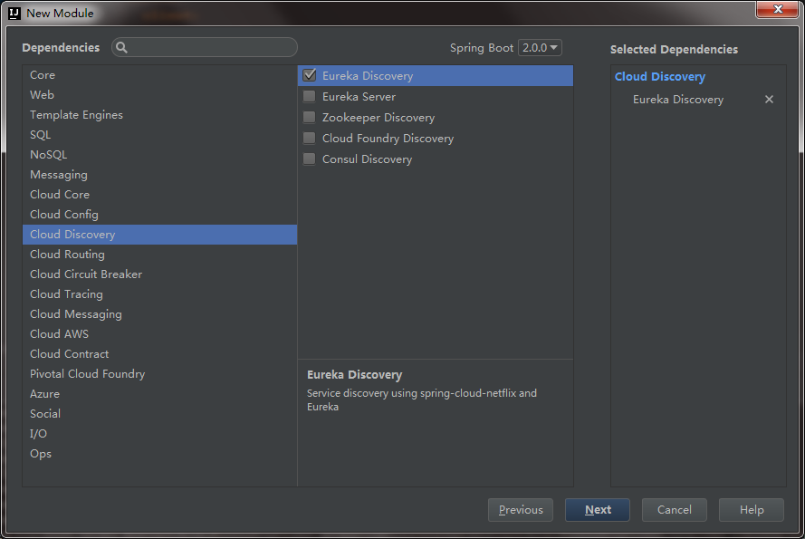

  >点击完成

* 在启动主类上加上`@EnableDiscoveryClient`注解
* 在`application-eureka.yml`配置文件中配置

  ```yml
  eureka:
    client:
      service-url:
        #向注册中心注册服务
        defaultZone: http://localhost:8761/eureka/
  ```
* 在主配置文件中配置

  ```yml
  spring:
    profiles:
      #要加载的配置文件
      active: eureka
    application:
      name: client
  server:
    port: 8080
  ```

* 启动项目,在配置中心页面查看

  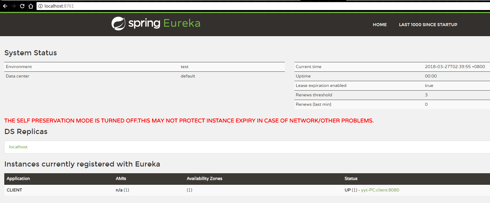

### EureKa的高可用

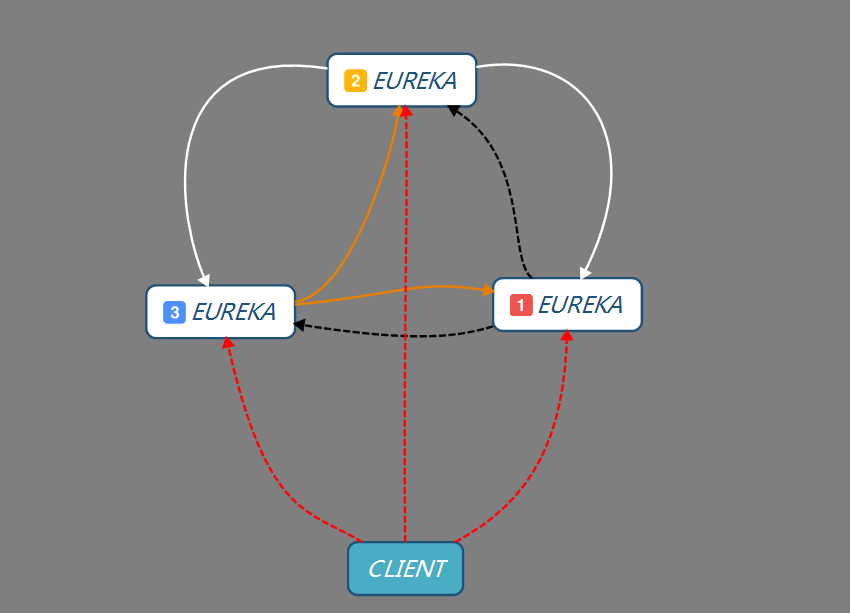

* 由于我们把各个应用都注册到了注册中心,为了防止注册中心挂掉,所以要配置多个注册中心
  * 各个注册中心要互相注册
  * 单个client要向每个注册中心注册
* 分别配置三个注册中心

  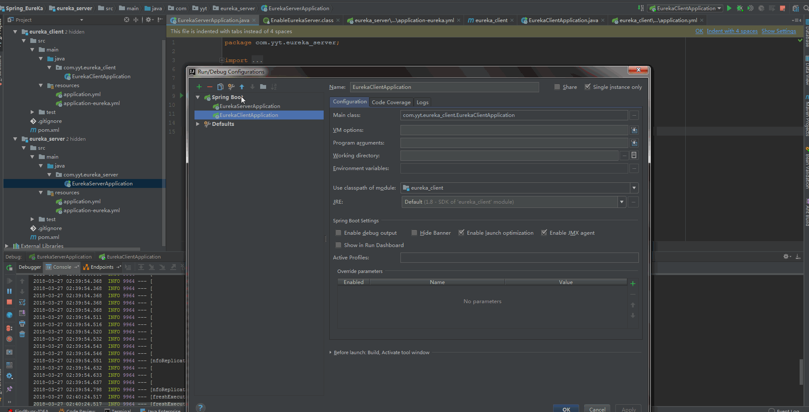

  * client端要向三个注册中心注册

    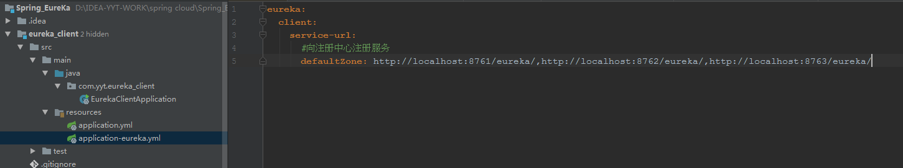

  * 启动三个注册中心`报错是因为另外两个注册中心还没有启动`

    

### 服务与服务之间通过Feign相互调用
* 再建立一个服务中心的应用`如下图`
  * 用`clientB`服务调用`client`服务里的方法

    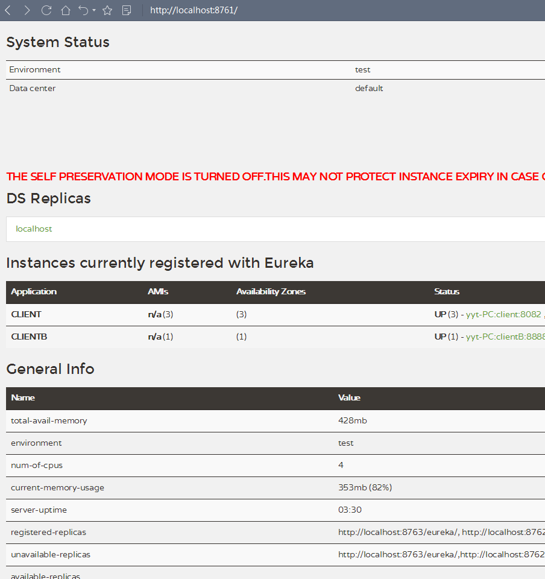

* 在clientB服务的pom文件中加入如下依赖

  ```xml
  <dependency>
    <groupId>org.springframework.cloud</groupId>
    <artifactId>spring-cloud-starter-openfeign</artifactId>
  </dependency>
  ```
* 在clientB服务的启动类上面加上`@EnableFeignClients`注解

* 在clientB服务内定义一个接口,接口内容如下

  ```java
  //client 表示被调用服务的名称
  @FeignClient(name ="client" )
  public interface ToTest {
      //对应被调用服务的Controller 路径
      @GetMapping("test")
      String test();
  }
  ```
* 然后在clientB服务中定义一个controller 把该接口注入

  ```java
  @Controller
  public class TestClient {

      @Autowired
      //注入接口
      private ToTest toTest;

      @RequestMapping("/test")
      @ResponseBody
      public String test(){
          String result = toTest.test();
          return result;
      }
  }
  ```

* 被调用服务的对应的controller

  ```java
  @RequestMapping(value = "/")
  @Controller
  public class BeTransfer {

      @RequestMapping(value = "test")
      @ResponseBody
      public String test(){
          return "调用成功";
      }
  }
  ```

* 界面返回结果

  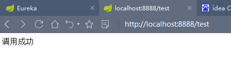

### EureKa的负载均衡

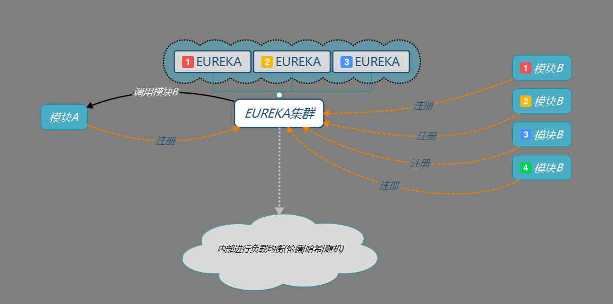

* 当服务B向注册中心注册后,如果该服务挂掉了,服务A想从注册中心调用服务B就会出现调用失败
* 所以每个服务要部署多个以提高系统的容错性
* EureKa会监测服务的健康指数,内部会把健康的服务返回给调用模块
* 根据配置多个注册中心的方法,配置多个`client`服务,设置不同的访问地址

  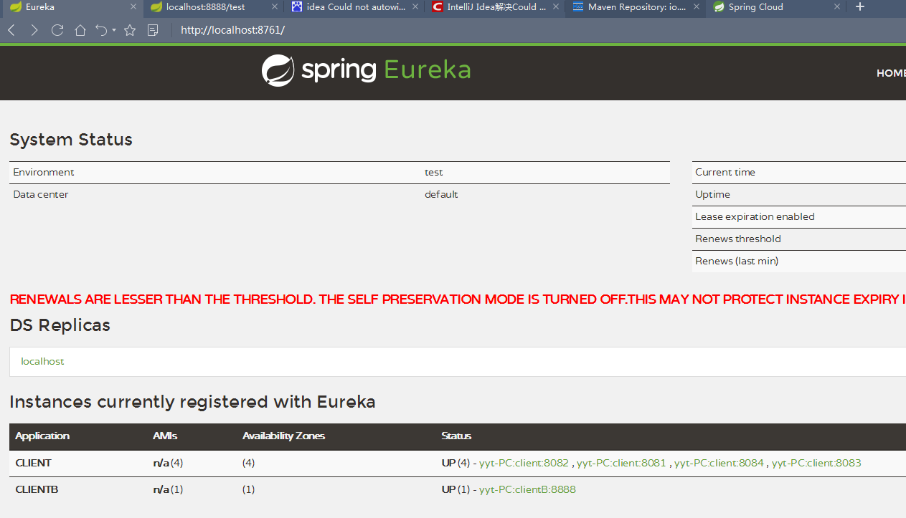

* 最后用clientB服务调用client服务,并逐个关闭client服务,当最后一个client服务关闭前,clientB服务都是可以正常调用client服务的

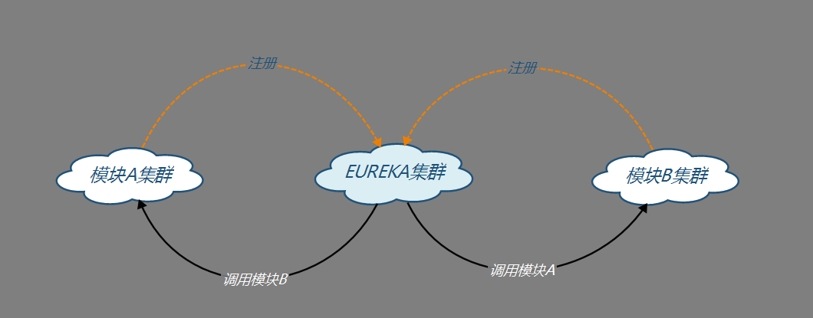
