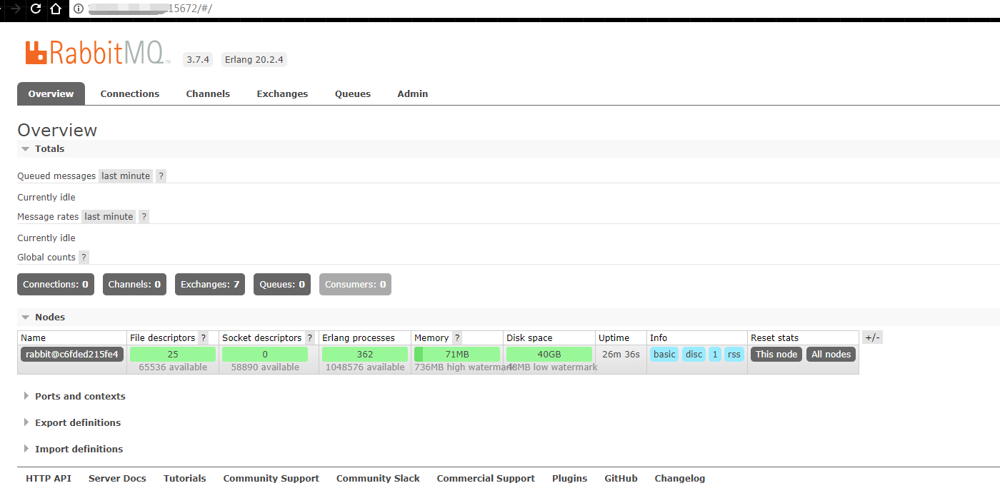

# RabbitMQ
* 常见的消息中间件
> [RabbitMQ](https://www.rabbitmq.com/)
> [KafKa](http://kafka.apache.org/)
> [ActiveMQ](http://activemq.apache.org/)

### 在[Docker](https://www.docker.com/) 中安装RabbitMQ

* 查找rabbitmq的镜像
  * `docker search rabbitmq`
* 使用第一个，官方提供的
  * `docker pull docker.io/rabbitmq`
* 开始创建rabbitmq容器
  * `docker run -d --name myrabbitmq -p 5672:5672 -p 15672:15672 docker.io/rabbitmq:3-management`
  * 第二个5672是项目中连接rabbitmq默认的端口(第一个为本地映射的)
  * 第二个15672是rabbitmq的web管理界面默认端口(第一个为本地映射的)
* 在浏览器输入地址访问

**>>未完待续<<**
