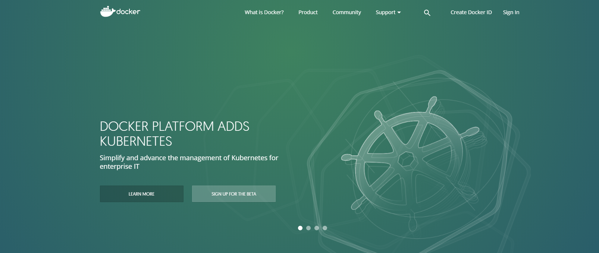
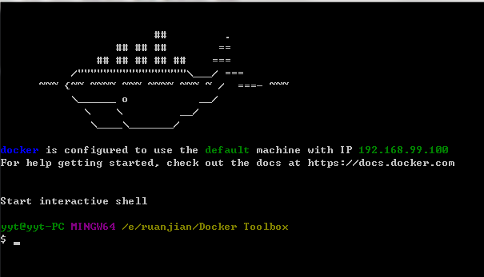

# Docker

[](https://www.docker.com/)

>解决了软件开发,测试和运维的问题
>可以`简单`的理解为一个轻量级的虚拟机
>把一个程序放在独立的环境里面运行

### 安装 Centos 方式一

* 删除非官方的Docker软件包
  * `sudo yum -y remove docker docker-common container-selinux`
* 删除docker-selinux与官方docker-engine软件包冲突的软件包
  * `sudo yum -y remove docker-selinux`
* 安装yum-utils，它提供了yum-config-manager实用程序
  * `sudo yum install -y yum-utils`
* 使用以下命令设置稳定的存储库

```shell
sudo yum-config-manager \
    --add-repo \
    https://docs.docker.com/v1.13/engine/installation/linux/repo_files/centos/docker.repo
```

* 更新yum软件包索引
  * `sudo yum makecache fast`
* 安装Docker
  * 安装最新版
    * `sudo yum -y install docker-engine`
  * 安装特定版本的Docker
    * `yum list docker-engine.x86_64  --showduplicates |sort -r`
    ```shell
    docker-engine.x86_64  1.13.0-1.el7                               docker-main
    docker-engine.x86_64  1.12.5-1.el7                               docker-main   
    docker-engine.x86_64  1.12.4-1.el7                               docker-main   
    docker-engine.x86_64  1.12.3-1.el7                               docker-main  
    ```
    * 选择一个特定的版本进行安装
      * `sudo yum -y install docker-engine-<VERSION_STRING>`
* 启动Docker
  * `sudo systemctl start docker`
* 运行hello-world 映像验证安装是否正确
  * `sudo docker run hello-world`
* 升级Docker
  * `sudo yum makecache fast`
  * 然后选择要安装的新版本


### 安装 Centos 方法二

* 更新软件源
  * `sudo yum update`

* 将Docker的安装源写入Yum的软件仓库中

  ```
  sudo tee /etc/yum.repos.d/docker.repo <<-'EOF'
  [dockerrepo]
  name=Docker Repository
  baseurl=https://yum.dockerproject.org/repo/main/centos/7/
  enabled=1
  gpgcheck=1
  gpgkey-https://yum.dockerproject.org/gpg
  EOF
  ```

* 用Yum安装Docker
  * `sudo yum install docker-engine`

* 安装完成后,启动Docker服务
  * `sudo service docker start`

### 安装 Windows

* 如果是window10 专业版的话

  [Docker](https://download.docker.com/win/stable/Docker%20for%20Windows%20Installer.exe)

* 如果是非专业版或window10以下的话
  [Docker Toolbox](https://download.docker.com/win/stable/DockerToolbox.exe)

* 然后下一步就可以了

* 验证
  * 在cmd输入`docker -v`
  * 安装正常的话会打印 docker的版本

* 在桌面上找到`Docker Quickstart Terminal`快捷方式并启动
  * 它会提示找不到`boot2docker.iso`文件正在从github上下载到你的某个目录`从提示信息可以看出来下载哪里去了`
    * 在安装Docker Toolbox目录下找到`boot2docker.iso`文件复制到那个到上面的目录
  * 重新点击`Docker Quickstart Terminal`快捷方式

    


## 镜像的使用

> * `Docker镜像类似于虚拟机镜像，可以将它理解为一个只读的模板。例如，一个镜像可以包含一个基本的操作系统环境，里面仅安装了Apache应用程序（或用户需要的其他软件）。可以把它称为一个Apache镜像。`

> * `镜像是创建Docker容器的基础。通过版本管理和增量的文件系统，Docker提供了一套十分简单的机制来创建和更新现有的镜像，用户甚至可以从网上下载一个已经做好的应用镜像，并直接使用。`

### 获取镜像
  * **`docker pull NAME[：TAG]`**
  * 其中，NAME是镜像仓库的名称（用来区分镜像），TAG是镜像的标签（往往用来表示版本信息）。通常情况下，描述一个镜像需要包括“名称+标签”信息。
  * 对于Docker镜像来说，如果不显式指定TAG，则默认会选择latest标签，这会下载仓库中最新版本的镜像。
    * `docker pull ubuntu`
      * 该命令实际上下载的就是ubuntu：latest镜像。

> * 严格地讲，镜像的仓库名称中还应该添加仓库地址（即registry，注册服务器）作为前缀，只是我们默认使用的是Docker Hub服务，该前缀可以忽略。
> * 例如，docker pull ubuntu：14.04命令相当于docker pull registry.hub.docker.com/ubuntu：14.04命令，即从默认的注册服务器Docker Hub Registry中的ubuntu仓库来下载标记为14.04的镜像。
> * 如果从非官方的仓库下载，则需要在仓库名称前指定完整的仓库地址。例如从网易蜂巢的镜像源来下载ubuntu：14.04镜像，可以使用如下命令，此时下载的镜像名称为hub.c.163.com/public/ubuntu：14.04  **`docker pull hub.c.163.com/public/ubuntu:14.04`**

### 查看镜像信息

* 使用images命令列出镜像
  * **使用docker images命令可以列出本地主机上已有镜像的基本信息。**
  * `docker images`

    ```shell
    $ docker images
    REPOSITORY               TAG            IMAGE ID        CREATED         SIZE
    ubuntu                   16.04          2fa927b5cdd3    2 weeks ago     122 MB
    ubuntu                   latest         2fa927b5cdd3    2 weeks ago     122 MB
    ubuntu                   14.04          8f1bd21bd25c    2 weeks ago     188 MB
    ```
* 使用tag命令添加镜像标签
  * ` docker tag name:tag newName:newTag`
  * 镜像的ID指向的是同一个地址,说明只是对该镜像添加了一个映射

  ```shell
  [root@192 dong]# docker tag ubuntu:16.04 yytubuntu:16.04
  [root@192 dong]# docker images
  REPOSITORY          TAG                 IMAGE ID            CREATED             SIZE
  yytubuntu           16.04               5e8b97a2a082        5 weeks ago         114MB
  ubuntu              16.04               5e8b97a2a082        5 weeks ago         114MB
  ```

* 查看镜像历史
  * `docker history ubuntu:16.04`

    ```shell
    IMAGE               CREATED             CREATED BY                                      SIZE                COMMENT
    5e8b97a2a082        5 weeks ago         /bin/sh -c #(nop)  CMD ["/bin/bash"]            0B                  
    <missing>           5 weeks ago         /bin/sh -c mkdir -p /run/systemd && echo '...   7B                  
    <missing>           5 weeks ago         /bin/sh -c sed -i 's/^#\s*\(deb.*universe\...   2.76kB              
    <missing>           5 weeks ago         /bin/sh -c rm -rf /var/lib/apt/lists/*          0B                  
    <missing>           5 weeks ago         /bin/sh -c set -xe   && echo '#!/bin/sh' >...   745B                
    <missing>           5 weeks ago         /bin/sh -c #(nop) ADD file:d37ff24540ea770...   114MB               
    ```

* 搜寻镜像
  * `docker search ubuntu`

    ```shell
    NAME                                                      DESCRIPTION                                     STARS     OFFICIAL   AUTOMATED
    ubuntu                                                    Ubuntu is a Debian-based Linux operating s...   7984      [OK]       
    dorowu/ubuntu-desktop-lxde-vnc                            Ubuntu with openssh-server and NoVNC            193                  [OK]
    rastasheep/ubuntu-sshd                                    Dockerized SSH service, built on top of of...   156                  [OK]
    ansible/ubuntu14.04-ansible                               Ubuntu 14.04 LTS with ansible                   93                   [OK]
    ubuntu-upstart                                            Upstart is an event-based replacement for ...   87        [OK]       
    neurodebian                                               NeuroDebian provides neuroscience research...   50        [OK]       
    ubuntu-debootstrap                                        debootstrap --variant=minbase --components...   39        [OK]       
    1and1internet/ubuntu-16-nginx-php-phpmyadmin-mysql-5      ubuntu-16-nginx-php-phpmyadmin-mysql-5          36                   [OK]
    ```
    > `Name:镜像的名称`;`DESCRIPTION:描述`;`STARS:受欢迎程度`;`OFFICIAL:是否官方创建`;`AUTOMATED:是否自动创建`

* 查看镜像的详细信息
  * `docker inspect XXX:XX.XX`
  * `docker inspect ubuntu:16.04`
  * 使用docker inspect命令可以获取该镜像的详细信息，包括制作者、适应架构、各层的数字摘要等

* 删除镜像
  * 使用`镜像名:版本号`删除
    * `docker rmi ubuntu:16.04`
  * 使用镜像ID进行删除镜像的操作
    * `docker rmi imageID`
  * **`PS: 如果该镜像有多个标签(使用了tag操作) 则进行删除操作,并没有真的删除镜像,只是把对应的标签给删除了`**
  * 当要删除的镜像有对应的容器存在时,首先要关闭对应的容器
    * `docker ps -a`

      ```shell
      docker ps -a
      CONTAINER ID        IMAGE               COMMAND             CREATED             STATUS                      PORTS               NAMES
      9c0ba960afd9        ubuntu:16.04        "bash"              12 hours ago        Exited (130) 12 hours ago                       infallible_khorana
      ```
    * `docker stop 9c0ba960afd9`
    * `docker rm 9c0ba960afd9`

* 创建镜像
  *

## 容器的使用

> *  `Docker容器类似于一个轻量级的沙箱，Docker利用容器来运行和隔离应用。容器是从镜像创建的应用运行实例。可以将其启动、开始、停止、删除，而这些容器都是彼此相互隔离的、互不可见的。`

> * `可以把容器看做是一个简易版的Linux系统环境（包括root用户权限、进程空间、用户空间和网络空间等）以及运行在其中的应用程序打包而成的盒子。`

## 仓库的使用
> * `Docker仓库类似于代码仓库，它是Docker集中存放镜像文件的场所。`
