# spring cloud config

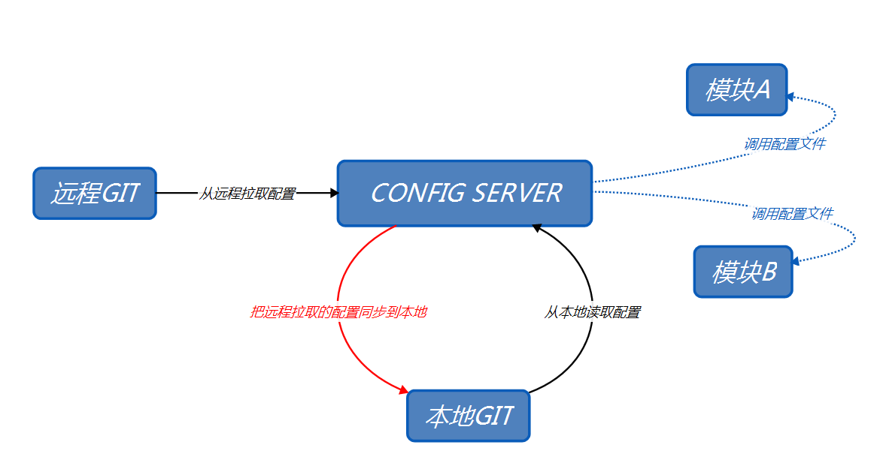

### 创建config server端

* 类似于EureKa Client端创建项目`(向EureKa注册)`,额外添加spring cloud config模块

  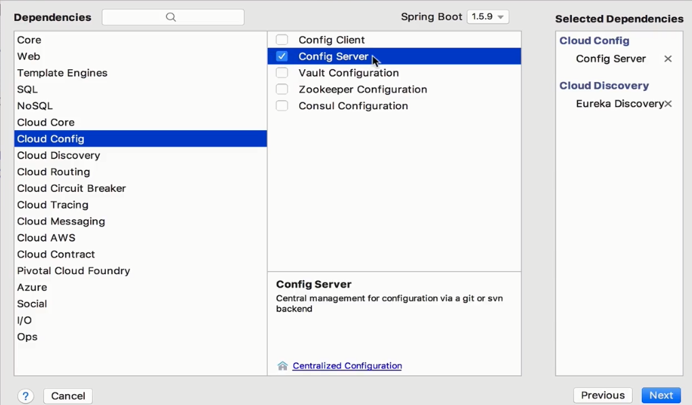

* 在启动类上面加上`@EnableConfigServer`注解

  ```java
  @SpringBootApplication
  @EnableDiscoveryClient
  @EnableConfigServer
  public class ConfigApplication {

  	public static void main(String[] args) {
  		SpringApplication.run(ConfigApplication.class, args);
  	}
  }
  ```

* `application-configserverTest.yml`配置
  * uri : `项目对应地址`**浏览器上面的URL**
  * username : 对应git账户的登陆名
  * password : 对应git账户的登陆密码
  * basedir : 配置文件拉取下来后的存放在本地的位置

  ```yml
  spring:
    cloud:
      config:
        server:
          #表示从git上拉取代码
          git:
            #项目地址
            uri: https://gitee.com/yangyetao/config
            #用户登录名
            username: wasd
            #登录密码
            password: qqq111222333
            #配置文件存放的路径
            basedir: D:\IDEA-YYT-WORK\2018-3-31\config
  ```

* `application-eureka.yml`配置参考EureKa Client的配置


* 测试
  * 新建项目,在项目下建立配置文件

    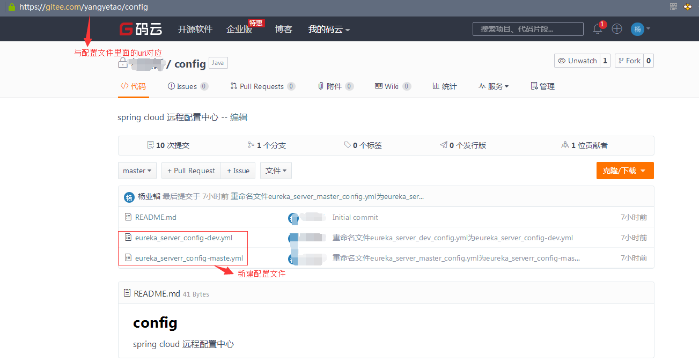

    * 配置文件内容

      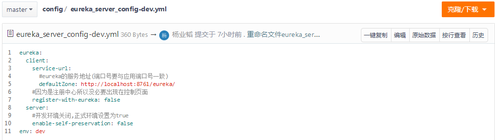

    * 启动项目然后在浏览器输入特定的url
      * `http://localhost:8888/eureka_server_config-dev.yml`
        * url中eureka_server_config-dev表示要读取的文件名
        * yml表示把文件中的参数转为什么格式

          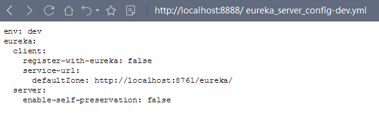

        * 同理也可以把配置读取为json格式

          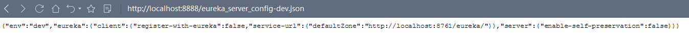

        * 如果git上的文件格式不正确页面会报错


### 创建config client端

* 在原有的EureKa Client端中的pom文件中添加以下依赖

  ```html
  <dependency>
  	<groupId>org.springframework.cloud</groupId>
  	<artifactId>spring-cloud-config-client</artifactId>
  </dependency>
  ```

* 把原有的`appliaction.yml`配置文件重命名为`bootstrap.yml`内容如下
  * `表示该配置文件最先加载`

  ```yml
  spring:
    profiles:
      #加载配置文件
      active: eureka,config
    application:
      #项目名
      name: client
  server:
    #端口号
    port: 8081

  ```

* `application-eureka.yml`

  ```yml
  eureka:
    client:
      service-url:
        #向注册中心注册服务
        defaultZone: http://localhost:8761/eureka/
  ```

* `application-config.yml`

  ```yml
  spring:
    cloud:
      config:
        discovery:
          #激活
          enabled: true
          #config server模块的名字
          service-id: CONFIG
        profile: dev

  ```

* 测试
  * 在git config项目上新建一个`client-dev.yml`文件
    * 命名规则
      * `调用配置文件的项目名`-`config client配置端profile参数`
    * 内容如下

      ```yml
      name: cxsm
      age: 16
      like: eat
      ```
  * 编写简单controller 返回配置文件的内容

    ```java
    @Controller
    @RequestMapping(value = "/config")
    public class ConfigController {

        @Value("${name}")
        private String name;

        @RequestMapping(value = "/test")
        @ResponseBody
        public String getName(){
            return name;
        }
    }
    ```
  * 界面显示

    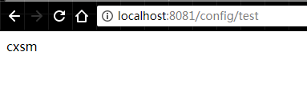

### 项目自动更新配置文件

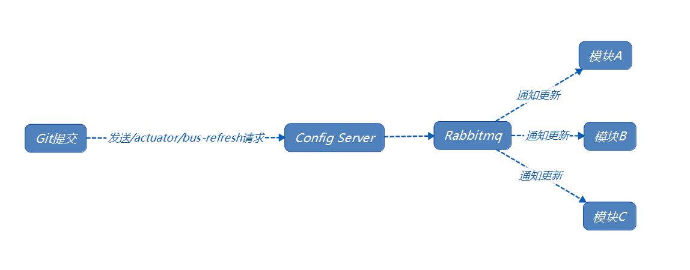

#### 基于 spring cloud bus 实现

* 在config server项目中引入spring cloud bus 依赖

  ```xml
  <dependency>
  	<groupId>org.springframework.cloud</groupId>
  	<artifactId>spring-cloud-starter-bus-amqp</artifactId>
  </dependency>
  ```

* 在`application-configserverTest.yml`中加上该配置

  ```yml
  spring:
    #配置rabbitmq的请求参数
    rabbitmq:
      #ip地址
      host: Rabbitmq IP path
      #端口号
      port: 5672
      #登录名(默认guest)
      username: guest
      #密码(默认guest)
      password: guest
  ```

* 启动该服务,进入rabbitmq控制页面查看

  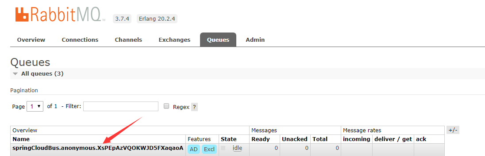

  * Rabbitmq里面新增了一个队列

* 同理在其他client模块种
  * pom文件里面加入
    ```xml
    <dependency>
    	<groupId>org.springframework.cloud</groupId>
    	<artifactId>spring-cloud-starter-bus-amqp</artifactId>
    </dependency>

    <!--添加spring-boot-starter-actuator依赖-->
    <dependency>
      <groupId>org.springframework.boot</groupId>
      <artifactId>spring-boot-starter-actuator</artifactId>
    </dependency>
    ```
  * 在yml配置文件中加入
    ```yml
    spring
      rabbitmq:
          host: Rabbitmq IP path
          port: 5672
          username: guest
          password: guest
    ```
  * 重启服务

    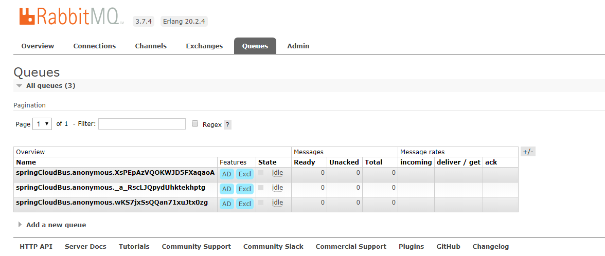

* 在config server项目里面添加如下配置

  ```yml
  #把所有接口暴露出去
  management:
    endpoints:
      web:
        exposure:
          include: '*'
  ```

* 重启项目
  * 模拟发送一个post请求`localhost:config_server_port/actuator/bus-refresh`
  * 在rabbitmq页面可以看到config server有接入数据

    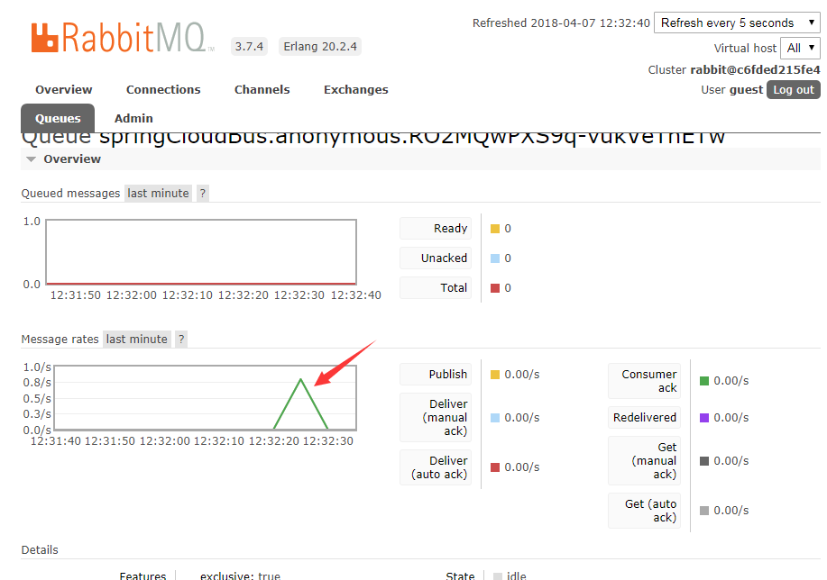

* 在Euraka Client项目中对调用远程配置的类上面加上`@RefreshScope`注解
  * 表示有`/actuator/bus-refresh`请求,就刷新到该注解的对应类下

  ```java
  @Controller
  @RequestMapping(value = "/config")
  @RefreshScope
  public class ConfigController {
      //为远程配置文件
      @Value("${name}")
      private String name;

      @RequestMapping(value = "/test")
      @ResponseBody
      public String getName(){
          return name;
      }
  }
  ```

#### 修改数据后发送`localhost:config_server_port/actuator/bus-refresh`请求查看配置发生变化没

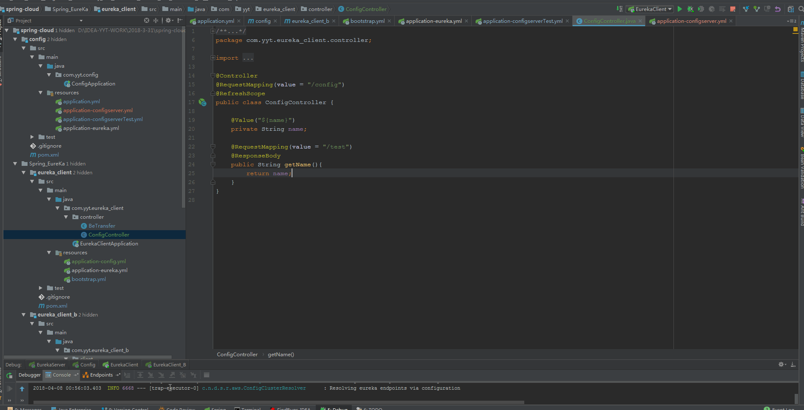

#### 通过git的`WebHooks`功能内网穿透刷新配置文件

* 开通一个隧道`这里使用的是Ngrok`
  * [教程](https://www.sunnyos.com/article-show-67.html)在官网

    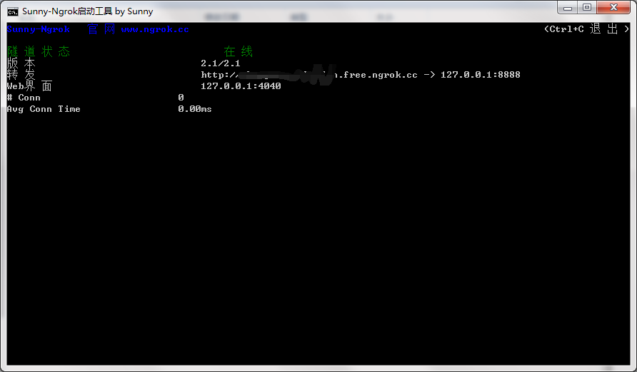
