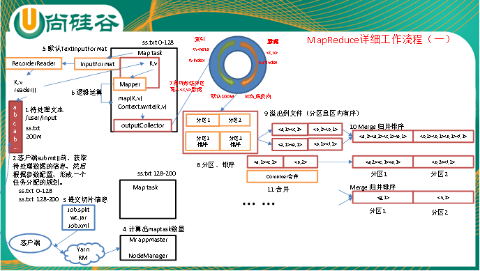
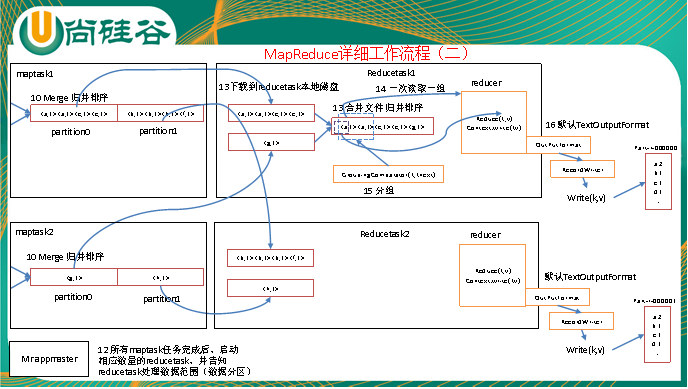

 

* 把文件进行逻辑切片
* 提交切片信息
* 计算得出maptask的数量
* 按切片数读文件
* 执行mapTask
* 把数据写入环形缓冲区
* 溢写之前把数据进行分区和排序
* 环形缓冲区开始溢写
* 因为环形缓冲区每到百分之80会溢写,会执行merge归并排序
* reducetask会拷贝maptask指定分区的文件
* reducetask合并文件,归并排序
* 把数据通过outputFormat写入文件里面
