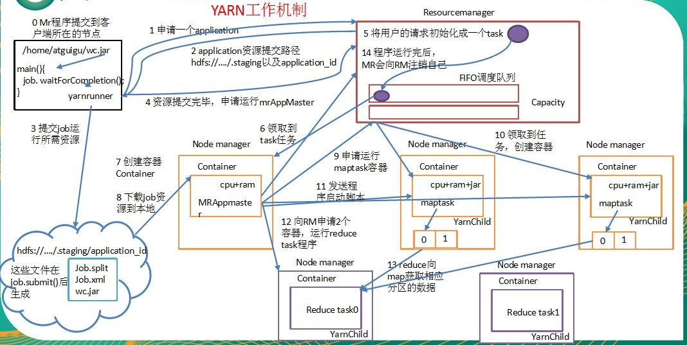

## hadoop的组成

### hadoop1.x与hadoop2.x的区别
> 在Hadoop1.x时代，Hadoop中的MapReduce同时处理业务逻辑运算和资源的调度，耦合性较大，在Hadoop2.x时代，增加了Yarn。Yarn只负责资源的调度，MapReduce只负责运算

### HDFS(Hadoop 分布式文件系统)架构概述
* NameNode
  > 存储文件的元数据, 如文件名 文件目录结构 文件属性(生成时间,副本数,文件权限)
* DataNode
  > 在本地文件系统存储文件块数据,以及数据的校验
* Secondary NameNode
  > 用来监控HDFS状态的辅助后台程序,会每个一段时间获取HDFS数据的快照

### YARN架构概述
* ResourceManager
  > 处理客户端请求,启动/监控ApplicationMaster,监控NodeManager,资源分配与调度
* NodeManager
  > 负责单个节点的资源调度,接收并出入ResiurceManager的命令,处理来自ApplicationMaster的命令
* ApplicationMaster
  > 数据切分,为应用程序申请资源, 用Driver端进行调用

### MapReduce
* Map阶段
  * 并行(多个节点同时进行处理)处理输入数据
* Reduce阶段
  * 对Map结果进行汇总(将所有节点数据进行归约汇总)

## hadoop压缩

* hadoop支持的压缩编码

压缩格式 |	hadoop自带？ |	算法 |	文件扩展名 |	是否可切分 |	换成压缩格式后，原来的程序是否需要修改
-- | -- | -- | -- | -- |--
Deflate |	是，直接使用 |	Defalate |	.deflate |	否 |	和文本处理一样，不需要修改
Gzip |	是，直接使用 |	Defalate |	.gz |	否 |	和文本处理一样，不需要修改
bzip2 |	是，直接使用 |	bzip2 |	.bz2 |	是 |	和文本处理一样，不需要修改
LZO |	否，需要安装 |	LZO |	.lzo |	是 |	需要建索引，还需要指定输入格式
Snappy |	否，需要安装 |	Snappy |	.snappy |	否 |	和文本处理一样，不需要修改

* 压缩性能比较

压缩算法 |	原始文件大小 |	压缩文件大小 |	压缩速度 |	解压速度
-- | -- | -- | -- | --
gzip |	8.3GB |	1.8GB |	17.5MB/s |	58MB/s
bzip2 |	8.3GB |	1.1GB |	2.4MB/s |	9.5MB/s
LZO |	8.3GB |	2.9GB |	49.3MB/s |	74.6MB/s
Snappy | 8.3GB | 3.2GB | 250MB/s | 500MB/s

* 应用场景选择
  * Gzip
    * 当每个文件压缩之后在130M以内的（1个块大小内），都可以考虑用gzip压缩格式。
  * Bzip2
    * 适合对速度要求不高，但需要较高的压缩率的时候，可以作为mapreduce作业的输出格式；或者输出之后的数据比较大，处理之后的数据需要压缩存档减少磁盘空间并且以后数据用得比较少的情况；或者对单个很大的文本文件想压缩减少存储空间，同时又需要支持split，而且兼容之前的应用程序（即应用程序不需要修改）的情况。
  * LZO
    * 一个很大的文本文件，压缩之后还大于200M以上的可以考虑，而且单个文件越大，lzo优点越越明显。
  * Snappy
    * 当Mapreduce作业的Map输出的数据比较大的时候，作为Map到Reduce的中间数据的压缩格式；或者作为一个Mapreduce作业的输出和另外一个Mapreduce作业的输入。

## YARN工作机制详解讲解

 
* MR程序通过Drive提交到ResourceManager
* ResourceManager返回一个资源提交路径
* 在资源提交路径下提交MR
* MR提交完毕,申请运行AppMaster
* 将用户的请求初始化为一个task
* NodeManager领取任务
* 该NodeManager会启动一个AppMaster,并向ResourceManager注册自己
* AppMaster会向ResourceManager申请MapTask
* 申请成功后AppMaster会发送启动脚本,启动各个MapTask 进行计算
* ReduceTask(MR里面进行指定)会把MapTask的计算数据拷贝过来,最后进行聚合输出
* ReduceTask最后去ResourceManager注销自己

## 任务推测执行

> 发现拖后腿的任务，比如某个任务运行速度远慢于任务平均速度。为拖后腿任务启动一个备份任务，同时运行。谁先运行完，则采用谁的结果。

* 执行推测任务的前提条件
  * 每个task只能有一个备份任务
  * 当前job已完成的task必须不小于0.05（5%）
  * 开启推测执行参数设置。Hadoop2.7.2 mapred-site.xml文件中默认是打开的
* 内部实现
  * 推测运行时间= (当前时刻 - 任务启动时刻) / 任务完成比例
  * 推测执行完成时刻= 推测运行时间 + 任务启动时刻
  * 备份任务推测完成时刻 = 当前时刻 + 运行完成任务的平均时间
* MR总是选择(推测执行完成时刻 - 备份任务推测完成时刻) 差值最大的任务, 并为之启动备份任务

## Hadoop优化
* 数据倾斜
* map和reduce数设置不合理
* map运行时间太长, 导致reduce等待过久
* 小文件过多
* 大量不可分块的超大文件(如: 某个压缩文件)
* spill次数过多
* merge次数过多

### 数据输入优化
* 合并小文件,在执行MR之前对小文件进行合并
  * 采用(CombineTextInputFormat)来作为输入
    * 把多个小文件逻辑划分到一个切片里面 交给一个MR进行处理

### Map阶段
* 减小溢写(spill)次数, 生成的小文件就小了
  * 通过调整`io.sort.mb`及`sort.spill.percent`参数值,增大触发spill的内存上限,减少磁盘IO
* 减少合并(merge)次数
  * 通过调整`io.sort.factor`参数,增大merge的文件数目,减少merge的次数,从而缩短mr处理的时间

### Reduce阶段
* 根据需求合理设置reduce数,一般与节点数相同
* 设置map与reduce共存
  * 调整`slowstart.completedmaps`参数,使map运行到一定程度后,reduce也开始运行,减少reduce的等待时间
* 规避使用reduce
  * 因为reduce端要去拷贝数据(花费大量时间),reduce也会发生数据倾斜
* 合理设置reduce端的buffer
  * 调整`mapred.job.reduce.input.buffer.percent`的大小,让reduce直接从buffer中拷贝数据,不直接从磁盘拷贝
    * 默认值为0.0不往内存进行存储
### I/O传输
  * 数据进行压缩

  ### **常用调优参数**

  > 资源相关参数

  * 以下参数是在用户自己的mr应用程序中配置就可以生效（mapred-default.xml）

  配置参数 | 参数说明
  -- | --
  mapreduce.map.memory.mb | 一个Map Task可使用的资源上限（单位:MB），默认为1024。如果Map Task实际使用的资源量超过该值，则会被强制杀死。
  mapreduce.reduce.memory.mb | 一个Reduce Task可使用的资源上限（单位:MB），默认为1024。如果Reduce Task实际使用的资源量超过该值，则会被强制杀死。
  mapreduce.map.cpu.vcores | 每个Map task可使用的最多cpu core数目，默认值: 1
  mapreduce.reduce.cpu.vcores | 每个Reduce task可使用的最多cpu core数目，默认值: 1
  mapreduce.reduce.shuffle.parallelcopies | 每个reduce去map中拿数据的并行数。默认值是5
  mapreduce.reduce.shuffle.merge.percent | buffer中的数据达到多少比例开始写入磁盘。默认值0.66
  mapreduce.reduce.shuffle.input.buffer.percent | buffer大小占reduce可用内存的比例。默认值0.7
  mapreduce.reduce.input.buffer.percent | 指定多少比例的内存用来存放buffer中的数据，默认值是0.0

  * 应该在yarn启动之前就配置在服务器的配置文件中才能生效（yarn-default.xml）

  配置参数 | 参数说明
  -- | --
  yarn.scheduler.minimum-allocation-mb | 给应用程序container分配的最小内存，默认值：1024
  yarn.scheduler.maximum-allocation-mb | 给应用程序container分配的最大内存，默认值：8192
  yarn.scheduler.minimum-allocation-vcores | 每个container申请的最小CPU核数，默认值：1
  yarn.scheduler.maximum-allocation-vcores | 每个container申请的最大CPU核数，默认值：32
  yarn.nodemanager.resource.memory-mb | 给containers分配的最大物理内存，默认值：8192

  * shuffle性能优化的关键参数，应在yarn启动之前就配置好（mapred-default.xml）

  配置参数 | 参数说明
  -- | --
  mapreduce.task.io.sort.mb | shuffle的环形缓冲区大小，默认100m
  mapreduce.map.sort.spill.percent | 环形缓冲区溢出的阈值，默认80%

  * 容错相关参数(mapreduce性能优化)

  配置参数 | 参数说明
  -- | --
  mapreduce.map.maxattempts | 每个Map Task最大重试次数，一旦重试参数超过该值，则认为Map Task运行失败，默认值：4
  mapreduce.reduce.maxattempts | 每个Reduce Task最大重试次数，一旦重试参数超过该值，则认为Map Task运行失败，默认值：4
  mapreduce.task.timeout | Task超时时间，经常需要设置的一个参数，该参数表达的意思为：如果一个task在一定时间内没有任何进入，即不会读取新的数据，也没有输出数据，则认为该task处于block状态，可能是卡住了，也许永远会卡住，为了防止因为用户程序永远block住不退出，则强制设置了一个该超时时间（单位毫秒），默认是600000。如果你的程序对每条输入数据的处理时间过长（比如会访问数据库，通过网络拉取数据等），建议将该参数调大，该参数过小常出现的错误提示是“AttemptID:attempt_14267829456721_123456_m_000224_0 Timed out after 300 secsContainer killed by the ApplicationMaster.”

  ### 小文件的优化

  * `Hadoop Archive`
  	* 是一个高效地将小文件放入HDFS块中的文件存档工具，它能够将多个小文件打包成一个HAR文件，这样就减少了namenode的内存使用。
  * `Sequence file`
  	* sequence file由一系列的二进制key/value组成，如果key为文件名，value为文件内容，则可以将大批小文件合并成一个大文件
  * `CombineFileInputFormat`
  	* CombineFileInputFormat是一种新的inputformat，用于将多个文件合并成一个单独的split，另外，它会考虑数据的存储位置
  * **开启JVM重用**
  	* 对于大量小文件Job，可以开启JVM重用会减少45%运行时间。JVM重用理解：一个map运行一个jvm，重用的话，在一个map在jvm上运行完毕后，jvm继续运行其他map
  	* 具体设置：mapreduce.job.jvm.numtasks值在10-20之间

## HDFS写文件流程
* 客户端向nameNode请求上传文件
* namenode校验该客户端是否有上传文件的权限
* 有权限则告诉客户端开始准备上传
* 客户端请求上传第一个block(0~128),namenode通过机架感知和其它判断返回几个datanode表示用这几个dn来存储数据
* 客户端向对应的datanode建立block通道
* 对应的datanode应答成功
* 传输数据(packet)到对应的datanode
