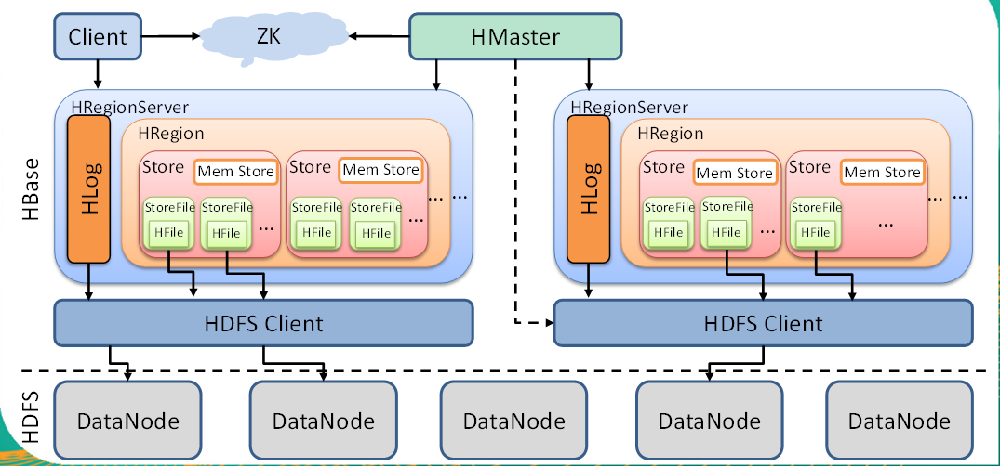

* 特点
  * 海量存储
    ```
    Hbase适合存储PB级别的海量数据，在PB级别的数据以及采用廉价PC存储的情况下，能在几十到百毫秒内返回数据。
    这与Hbase的极易扩展性息息相关。正式因为Hbase良好的扩展性，才为海量数据的存储提供了便利。
    ```
  * 列式存储
    ```
    这里的列式存储其实说的是列族存储，Hbase是根据列族来存储数据的。
    列族下面可以有非常多的列，列族在创建表的时候就必须指定。
    ```
  * 极易扩展
    ```
    Hbase的扩展性主要体现在两个方面，一个是基于上层处理能力（RegionServer）的扩展，一个是基于存储的扩展（HDFS）。
    通过横向添加RegionSever的机器，进行水平扩展，提升Hbase上层的处理能力，提升Hbsae服务更多Region的能力。
    ```
  * 高并发
    ```
    由于目前大部分使用Hbase的架构，都是采用的廉价PC，因此单个IO的延迟其实并不小，一般在几十到上百ms之间。
    这里说的高并发，主要是在并发的情况下，Hbase的单个IO延迟下降并不多。能获得高并发、低延迟的服务。
    ```
  * 稀疏
    ```
    稀疏主要是针对Hbase列的灵活性，在列族中，你可以指定任意多的列，在列数据为空的情况下，是不会占用存储空间的。
    ```

### HBase架构
</br>
* Client
  * Client包含了访问Hbase的接口，另外Client还维护了对应的cache来加速Hbase的访问，比如cache的.META.元数据的信息
* Zookeeper
  * HBase通过Zookeeper来做master的高可用、RegionServer的监控、元数据的入口以及集群配置的维护等工作。具体工作如下：
    * 通过Zoopkeeper来保证集群中只有1个master在运行，如果master异常，会通过竞争机制产生新的master提供服务
    * 通过Zoopkeeper来监控RegionServer的状态，当RegionSevrer有异常的时候，通过回调的形式通知Master RegionServer上下线的信息
    * 通过Zoopkeeper存储元数据的统一入口地址
* Hmaster
  * 功能
    * 监控RegionServer
    * 处理RegionServer故障转移
    * 处理元数据的变更
    * 处理region的分配或转移
    * 在空闲时间进行数据的负载均衡
    * 通过Zookeeper发布自己的位置给客户端
  * 职责
    * 为RegionServer分配Region
    * 维护整个集群的负载均衡
    * 维护集群的元数据信息
    * 发现失效的Region，并将失效的Region分配到正常的RegionServer上
    * 当RegionSever失效的时候，协调对应Hlog的拆分
* HregionServer
  * 功能
    * 负责存储HBase的实际数据
    * 处理分配给它的Region
    * 刷新缓存到HDFS
    * 维护Hlog
    * 执行压缩
    * 负责处理Region分片
  * 职责
    * 管理master为其分配的Region
    * 处理来自客户端的读写请求
    * 负责和底层HDFS的交互，存储数据到HDFS
    * 负责Region变大以后的拆分
    * 负责Storefile的合并工作
* HDFS
  * 提供元数据和表数据的底层分布式存储服务
  * 数据多副本，保证的高可靠和高可用性
* HRegion
  * Hbase表的分片，HBase表会根据RowKey值被切分成不同的region存储在RegionServer中，在一个RegionServer中可以有多个不同的region。
  * 一个HRegionServer对应多个HRegion,一个HRegion对应一个表 但一个表可以对应多个HRegion
* store
  * 一个store对应一个列族,但一个列族是可以对应多个store的,因为HRegion会切分,HRegion切分时也会把store也切分过去
* MemStore
  * 内存存储，位于内存中，用来保存当前的数据操作，所以当数据保存在WAL中之后，RegsionServer会在内存中存储键值对
* HFile
  * 这是在磁盘上保存原始数据的实际的物理文件，是实际的存储文件。StoreFile是以Hfile的形式存储在HDFS的。
* HLog
  > HBase的修改记录，当对HBase读写数据的时候，数据不是直接写进磁盘，它会在内存中保留一段时间（时间以及数据量阈值可以设定）。但把数据保存在内存中可能有更高的概率引起数据丢失，为了解决这个问题，数据会先写在一个叫做Write-Ahead logfile的文件中，然后再写入内存中。所以在系统出现故障的时候，数据可以通过这个日志文件重建。
