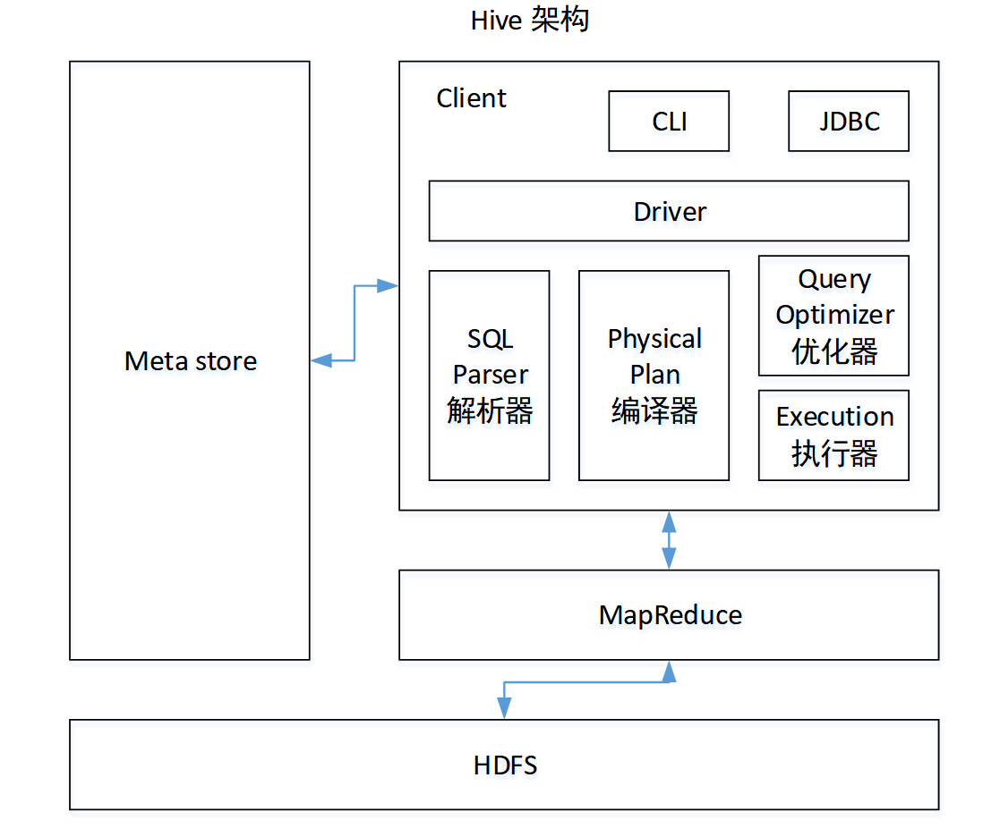

* sql解析器
* 编译器,把sql编译成MR
* 优化器,优化MR
* 执行器,执行优化好的MR

### 多插模式
```sql
hive (default)> from student
              insert overwrite table student partition(month='201707')
              select id, name where month='201709'
              insert overwrite table student partition(month='201706')
              select id, name where month='201709';
```

### 空字段赋值
```sql
select nvl(comm,-1) from emp;
```

### CASE WHEN
```sql
select
  dept_id,
  sum(case sex when '男' then 1 else 0 end) male_count,
  sum(case sex when '女' then 1 else 0 end) female_count
from
  emp_sex
group by
  dept_id;
```

### 行转列
* CONCAT(string A/col, string B/col…)
  * 返回输入字符串连接后的结果，支持任意个输入字符串;
* CONCAT_WS(separator, str1, str2,...)
  * 它是一个特殊形式的 CONCAT()。第一个参数剩余参数间的分隔符。分隔符可以是与剩余参数一样的字符串。如果分隔符是 NULL，返回值也将为 NULL。这个函数会跳过分隔符参数后的任何 NULL 和空字符串。分隔符将被加到被连接的字符串之间;
* COLLECT_SET(col)
  * 函数只接受基本数据类型，它的主要作用是将某字段的值进行去重汇总，产生array类型字段。


* 元数据

  name |	constellation |	blood_type
  --|--|--
  孙悟空|	白羊座|	A
  大海|	射手座|	A
  宋宋|	白羊座|	B
  猪八戒|	白羊座|	A
  凤姐|	射手座|	A
* 需求
  * 把星座和血型一样的人归类到一起。结果如下：
    射手座,A   |         大海\|凤姐
    --|--
    白羊座,A   |         孙悟空\|猪八戒
    白羊座,B   |         宋宋
* 查询语句
  ```sql
  select
      t1.base,
      concat_ws('|', collect_set(t1.name)) name
  from
      (select
          name,
          concat(constellation, ",", blood_type) base
      from
          person_info) t1
  group by
      t1.base;
  ```

### 列转行
* EXPLODE(col)
  * 将hive一列中复杂的array或者map结构拆分成多行。
* LATERAL VIEW
  * LATERAL VIEW udtf(expression) tableAlias AS columnAlias
* 元数据
  movie |	category
  -- | --
 《疑犯追踪》|	悬疑,动作,科幻,剧情
 《Lie to me》|	悬疑,警匪,动作,心理,剧情
 《战狼2》|	战争,动作,灾难
* 需求
《疑犯追踪》 |     悬疑
 -- | --
《疑犯追踪》   |   动作
《疑犯追踪》   |   科幻
《疑犯追踪》   |   剧情
《Lie to me》 |  悬疑
《Lie to me》 |  警匪
《Lie to me》 |  动作
《Lie to me》 |  心理
《Lie to me》 |  剧情
《战狼2》     |   战争
《战狼2》     |   动作
《战狼2》     |   灾难
* 查询语句
  ```sql
  select
      movie,
      category_name
  from
      movie_info lateral view explode(category) table_tmp as category_name;
  ```

### 窗口函数
* OVER()
  * 指定分析函数工作的数据窗口大小，这个数据窗口大小可能会随着行的变而变化
* CURRENT ROW
  * 当前行
* n PRECEDING
  * 往前n行数据
* n FOLLOWING
  * 往后n行数据
* UNBOUNDED
  * 起点，UNBOUNDED PRECEDING 表示从前面的起点， UNBOUNDED FOLLOWING表示到后面的终点
* LAG(col,n)
  * 往前第n行数据
* LEAD(col,n)
  * 往后第n行数据
* NTILE(n)
  * 把有序分区中的行分发到指定数据的组中，各个组有编号，编号从1开始，对于每一行，NTILE返回此行所属的组的编号。
* 元数据
  name | orderdate | cost
  -- | -- | --
  jack|2017-01-01|10
  tony|2017-01-02|15
  jack|2017-02-03|23
  tony|2017-01-04|29
  jack|2017-01-05|46
  jack|2017-04-06|42
  tony|2017-01-07|50
  jack|2017-01-08|55
  mart|2017-04-08|62
  mart|2017-04-09|68
  neil|2017-05-10|12
  mart|2017-04-11|75
  neil|2017-06-12|80
  mart|2017-04-13|94
* 需求
  * 查询在2017年4月份购买过的顾客及总人数
    ```sql
    select name,count(*) over ()
    from business
    where substring(orderdate,1,7) = '2015-04'
    group by name;
    ```
  * 查询顾客的购买明细及月购买总额
    ```sql
    select name,orderdate,cost,sum(cost) over(partition by month(orderdate)) from
     business;
    ```
  * 上述的场景,要将cost按照日期进行累加
    ```sql
    select name,orderdate,cost,
    sum(cost) over() as sample1,--所有行相加
    sum(cost) over(partition by name) as sample2,--按name分组，组内数据相加
    sum(cost) over(partition by name order by orderdate) as sample3,--按name分组，组内数据累加
    sum(cost) over(partition by name order by orderdate rows between UNBOUNDED PRECEDING and current row ) as sample4 ,--和sample3一样,由起点到当前行的聚合
    sum(cost) over(partition by name order by orderdate rows between 1 PRECEDING and current row) as sample5, --当前行和前面一行做聚合
    sum(cost) over(partition by name order by orderdate rows between 1 PRECEDING AND 1 FOLLOWING ) as sample6,--当前行和前边一行及后面一行
    sum(cost) over(partition by name order by orderdate rows between current row and UNBOUNDED FOLLOWING ) as sample7 --当前行及后面所有行
    from business;
    ```
  * 查询顾客上次的购买时间
    ```sql
    select name,orderdate,cost,
    lag(orderdate,1,'1900-01-01') over(partition by name order by orderdate ) as time1, lag(orderdate,2) over (partition by name order by orderdate) as time2
    from business;
    ```
  * 查询前20%时间的订单信息
    ```sql
    select * from (
        select name,orderdate,cost, ntile(5) over(order by orderdate) sorted
        from business
    ) t
    where sorted = 1;
    ```

### RANK
* RANK()
  * 排序相同时会重复，总数不会变
* DENSE_RANK()
  * 排序相同时会重复，总数会减少
* ROW_NUMBER()
  * 会根据顺序计算
* 元数据
  name |	subject |	score
  -- | -- | --
  孙悟空 |	语文|	87
  孙悟空|	数学 |	95
  孙悟空	|英语|	68
  大海|	语文|	94
  大海|	数学|	56
  大海|	英语|	84
  宋宋|	语文|	64
  宋宋|	数学|	86
  宋宋|	英语|	84
  婷婷|	语文|	65
  婷婷|	数学|	85
  婷婷|	英语|	78
* sql
  ```sql
  select name,
  subject,
  score,
  rank() over(partition by subject order by score desc) rp,
  dense_rank() over(partition by subject order by score desc) drp,
  row_number() over(partition by subject order by score desc) rmp
  from score;
  ```
* 结果
  name |   subject score  | rp   |   drp  |   rmp
  -- | -- | -- | -- | --
  孙悟空  |数学 |   95    |  1    |   1   |    1
  宋宋  |  数学 |   86  |    2   |    2    |   2
  婷婷   | 数学  |  85   |   3    |   3   |    3
  大海   | 数学  |  56  |    4    |   4    |   4
  宋宋  |  英语  |  84   |   1    |   1   |    1
  大海   | 英语   | 84  |    1   |    1   |    2
  婷婷 |   英语  |  78   |   3     |  2    |   3
  孙悟空 | 英语  |  68   |   4   |    3   |    4
  大海  |  语文  |  94   |   1   |    1    |   1
  孙悟空 | 语文   | 87    |  2   |    2   |    2
  婷婷   | 语文   | 65   |   3    |   3    |   3
  宋宋  |  语文  |  64   |   4    |   4    |   4

### 函数
* 查看系统自带的函数
  ```sql
  show functions;
  ```
* 显示自带的函数的用法
  ```sql
  desc function upper;
  ```
* 详细显示自带的函数的用法
  ```sql
  desc function extended upper;
  ```
#### 自定义UDF
* 导入依赖
  ```xml
  <dependencies>
  		<!-- https://mvnrepository.com/artifact/org.apache.hive/hive-exec -->
  		<dependency>
  			<groupId>org.apache.hive</groupId>
  			<artifactId>hive-exec</artifactId>
  			<version>1.2.1</version>
  		</dependency>
  </dependencies>
  ```
* 创建一个类
  ```java
  package com.atguigu.hive;
  import org.apache.hadoop.hive.ql.exec.UDF;

  public class Lower extends UDF {

  	public String evaluate (final String s) {

  		if (s == null) {
  			return null;
  		}

  		return s.toLowerCase();
  	}
  }
  ```
* 打成jar包上传到服务器如:`/opt/module/jars/udf.jar`
* 将jar包添加到hive的classpath
  * `hive (default)> add jar /opt/module/datas/udf.jar;`
* 创建临时函数与开发好的java class关联
  * `hive (default)> create temporary function mylower as "com.atguigu.hive.Lower";`
* 即可在hql中使用自定义的函数strip
  * `hive (default)> select ename, udf_lower(ename) lowername from emp;`

### hive存储格式
* TextFile
  > 默认格式，数据不做压缩，磁盘开销大，数据解析开销大。可结合Gzip、Bzip2使用，但使用Gzip这种方式，hive不会对数据进行切分，从而无法对数据进行并行操作。
* Orc
  > 每个Orc文件由1个或多个stripe组成，每个stripe250MB大小，这个Stripe实际相当于RowGroup概念
* Parquet
  ```
  Parquet是面向分析型业务的列式存储格式，由Twitter和Cloudera合作开发，2015年5月从Apache的孵化器里毕业成为Apache顶级项目。
  Parquet文件是以二进制方式存储的，所以是不可以直接读取的，文件中包括该文件的数据和元数据，因此Parquet格式文件是自解析的。
  通常情况下，在存储Parquet数据的时候会按照Block大小设置行组的大小，由于一般情况下每一个Mapper任务处理数据的最小单位是一个Block，这样可以把每一个行组由一个Mapper任务处理，增大任务执行并行度。
  ```
* 创建表，存储数据格式为parquet
  ```sql
  create table log_parquet(
  track_time string,
  url string,
  session_id string,
  referer string,
  ip string,
  end_user_id string,
  city_id string
  )
  row format delimited fields terminated by '\t'
  stored as parquet ;
  ```
* hadoop使用Snappy压缩
* 创建一个SNAPPY压缩的ORC存储方式
  ```sql
  create table log_orc_snappy(
  track_time string,
  url string,
  session_id string,
  referer string,
  ip string,
  end_user_id string,
  city_id string
  )
  row format delimited fields terminated by '\t'
  stored as orc tblproperties ("orc.compress"="SNAPPY");
  ```

### hive调优
* 开启Map端聚合参数设置
  * 是否在Map端进行聚合，默认为True
    * `hive.map.aggr = true`
  * 在Map端进行聚合操作的条目数目
    * `hive.groupby.mapaggr.checkinterval = 100000`
  * 有数据倾斜的时候进行负载均衡（默认是false）
    * `hive.groupby.skewindata = true`
* Count(Distinct)去重
  * 数据量小的时候无所谓，数据量大的情况下，由于COUNT DISTINCT操作需要用一个Reduce Task来完成，这一个Reduce需要处理的数据量太大，就会导致整个Job很难完成，一般COUNT DISTINCT使用先GROUP BY再COUNT的方式替换
  * `select count(id) from (select id from bigtable group by id) a;`
* 行列过滤
  * 列处理：在SELECT中，只拿需要的列，如果有，尽量使用分区过滤，少用SELECT *。
  * 行处理：在分区剪裁中，当使用外关联时，如果将副表的过滤条件写在Where后面，那么就会先全表关联，之后再过滤，比如:
    * 测试先关联两张表，再用where条件过滤
      ```sql
      select o.id from bigtable b
      join ori o on o.id = b.id
      where o.id <= 10;
      ```
    * 通过子查询后，再关联表
      ```sql
      select b.id from bigtable b
      join (select id from ori where id <= 10 ) o on b.id = o.id;
      ```
* 并行执行
  ```
  Hive会将一个查询转化成一个或者多个阶段。这样的阶段可以是MapReduce阶段、抽样阶段、合并阶段、limit阶段。或者Hive执行过程中可能需要的其他阶段。默认情况下，Hive一次只会执行一个阶段。不过，某个特定的job可能包含众多的阶段，而这些阶段可能并非完全互相依赖的，也就是说有些阶段是可以并行执行的，这样可能使得整个job的执行时间缩短。不过，如果有更多的阶段可以并行执行，那么job可能就越快完成。
  	通过设置参数hive.exec.parallel值为true，就可以开启并发执行。不过，在共享集群中，需要注意下，如果job中并行阶段增多，那么集群利用率就会增加。
  ```
  ```
  set hive.exec.parallel=true;              //打开任务并行执行
  set hive.exec.parallel.thread.number=16;  //同一个sql允许最大并行度，默认为8。
  ```
* JVM重用
  ```
  VM重用是Hadoop调优参数的内容，其对Hive的性能具有非常大的影响，特别是对于很难避免小文件的场景或task特别多的场景，这类场景大多数执行时间都很短。
  Hadoop的默认配置通常是使用派生JVM来执行map和Reduce任务的。这时JVM的启动过程可能会造成相当大的开销，尤其是执行的job包含有成百上千task任务的情况。JVM重用可以使得JVM实例在同一个job中重新使用N次。N的值可以在Hadoop的mapred-site.xml文件中进行配置。通常在10-20之间，具体多少需要根据具体业务场景测试得出。
  ```
  ```xml
  <property>
    <name>mapreduce.job.jvm.numtasks</name>
    <value>10</value>
    <description>How many tasks to run per jvm. If set to -1, there is
    no limit.
    </description>
  </property>
  ```
* hadoop选用合适的压缩格式
* hive选用合适的存储格式
