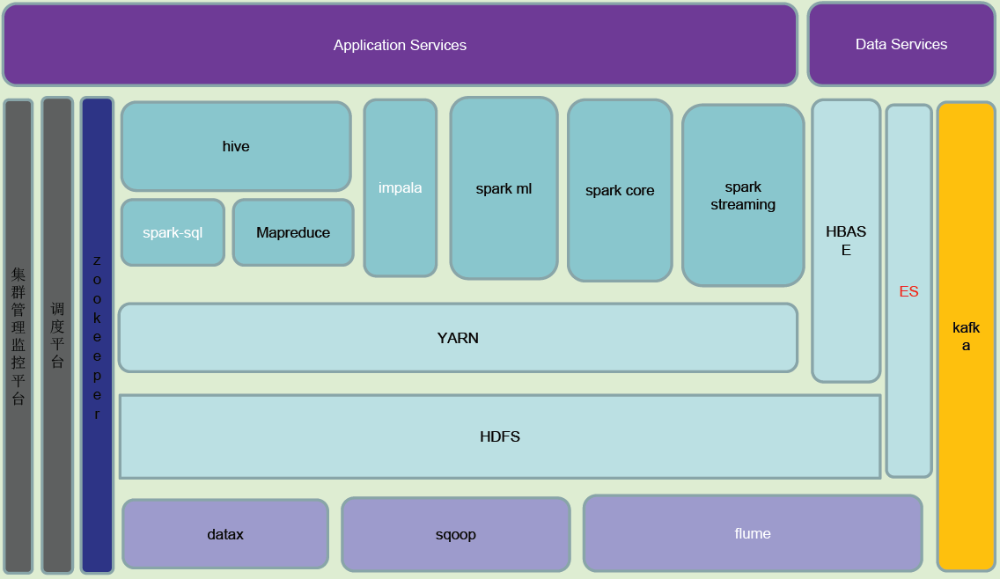
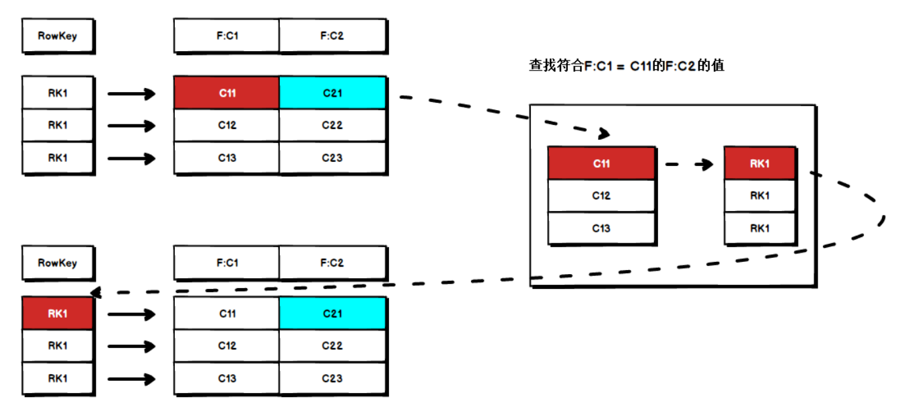
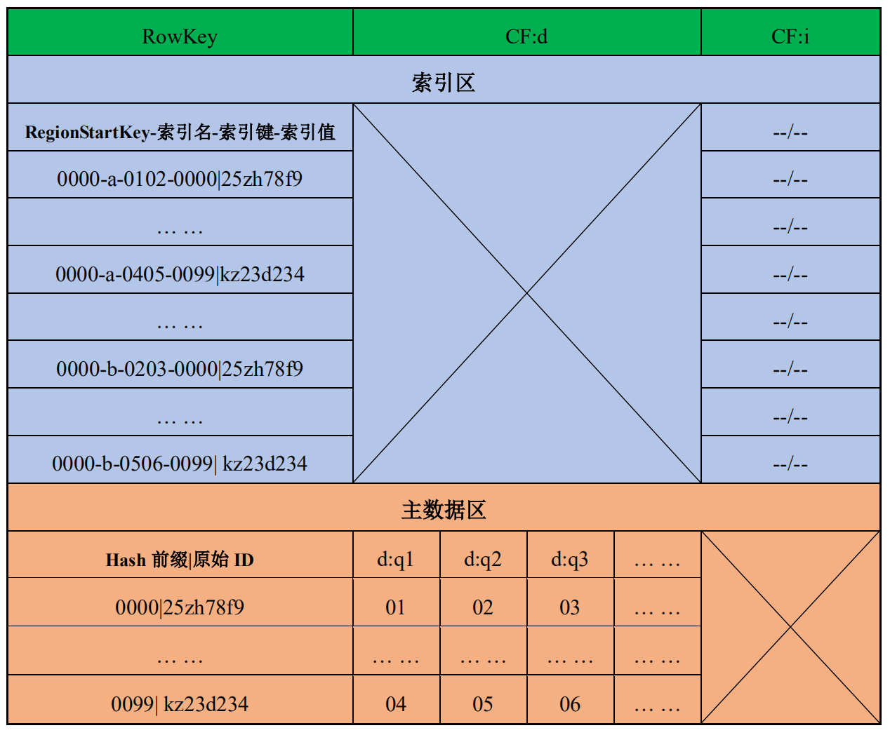
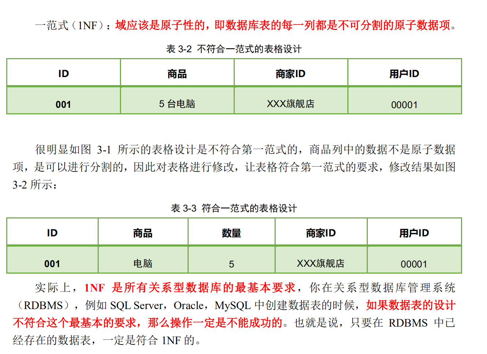
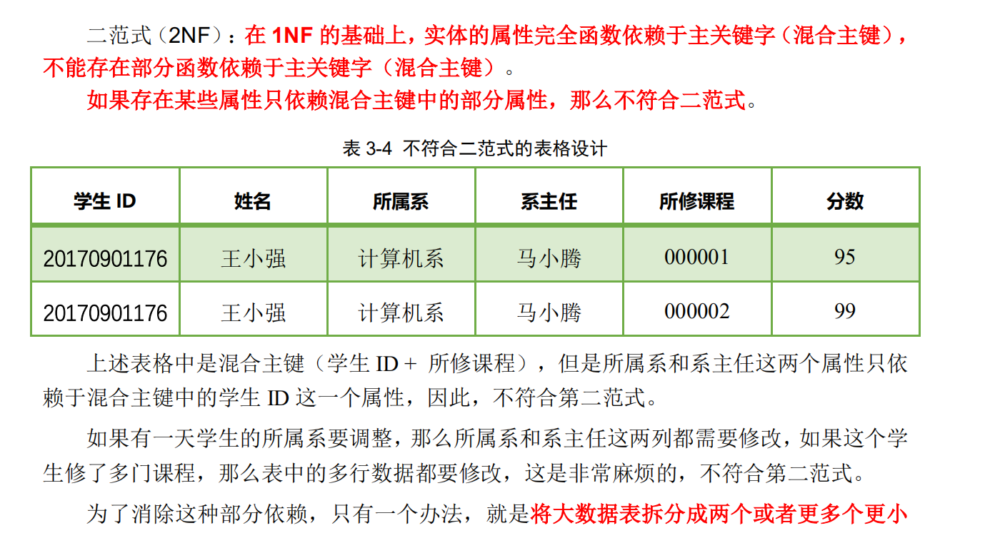
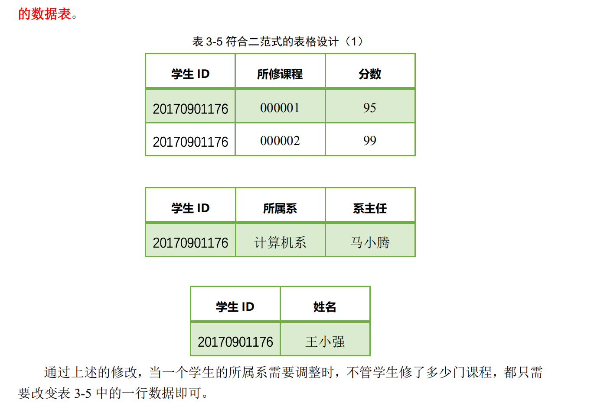
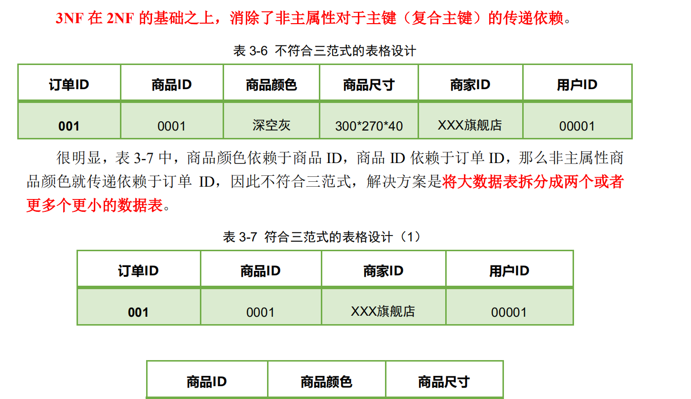
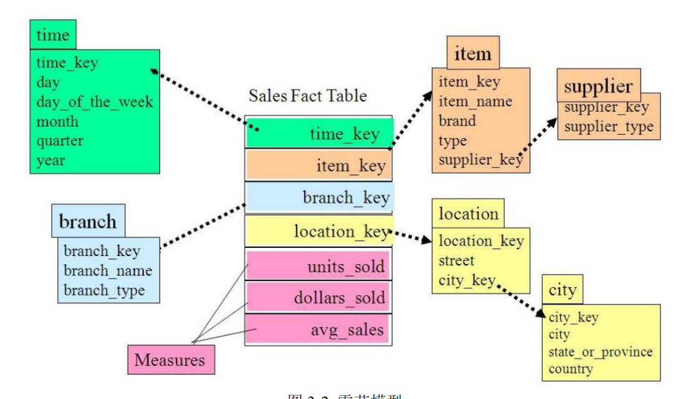
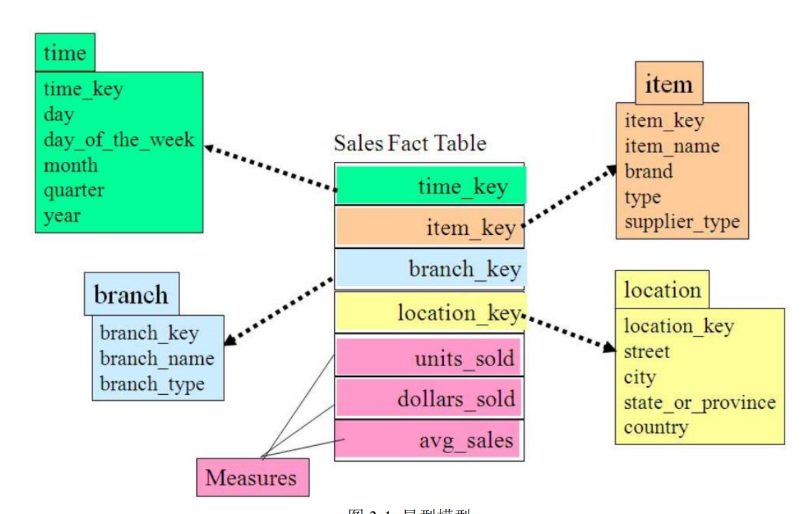
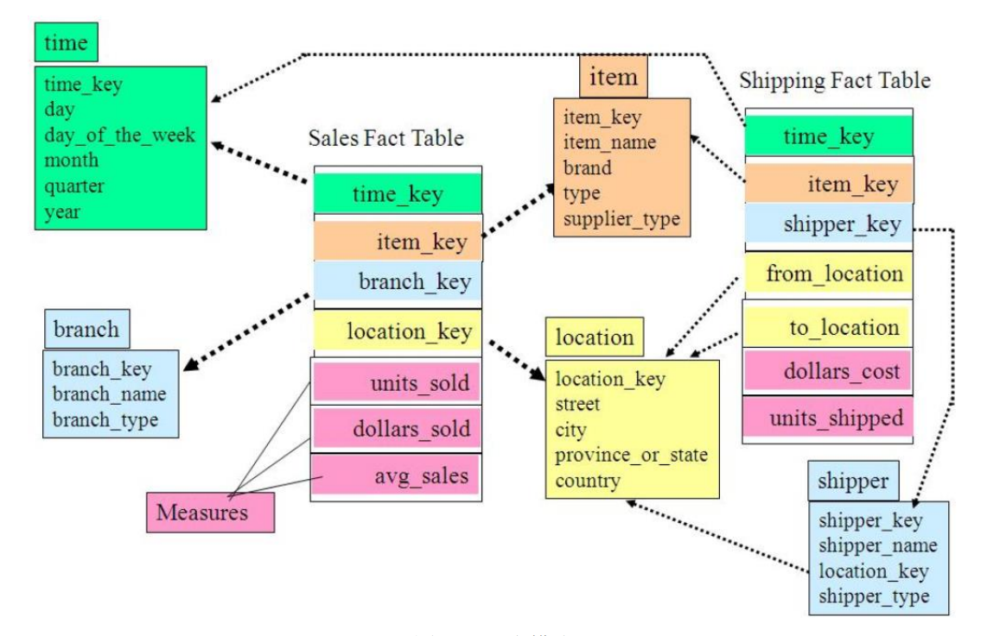

## 数据仓库
> 数据库是长期储存在计算机内、有组织的、可共享的数据集合。数据库中的数据指的是<br/>以一定的数据模型组织、描述和储存在一起、具有尽可能小的冗余度、较高的数据独立性和<bvr/>易扩展性的特点并可在一定范围内为多个用户共享。<br/>常用的数据库有 MySQL、ORACLE、SQL Server 等。

* 什么是数据仓库
  > 数据仓库是决策支持系统（dss）和联机分析应用数据源的结构化数据环境。数据仓库研究和解决从数据库中获取信息的问题。<br/>数据仓库的特征在于面向主题、集成性、稳定性和时变性，用于支持管理决策。<br/>数据仓库存在的意义在于对企业的所有数据进行汇总，为企业各个部门提供统一的，规范的数据出口。<br/><font color="red">把所有部门的数据进行汇总归一,对外提供一个统一的接口</font>

* 面向主题
  > 数据仓库中的数据是按照一定的主题域进行组织的，每一个主题对应一个宏<br/>观的分析领域。数据仓库排除对于决策无用的数据，提供特定主题的简明视图。
* 集成的
  > 企业内不同业务部门数据的完整集成。
* 稳定的
  > 数仓里不存在数据的更新和删除操作。
* 变化的
  > 数仓里会完整的记录某个对象在一段时期内的变化情况。

* ODS
  * 把基础数据(原始数据)原封不动的存储到改成
* DWD
  * 把数据进行一些清洗/脱敏/统一操作,进行粗粒度的清洗
* DWS
  * 公共汇总层(粗粒度的汇总,约满足百分之80的需求),这层进行轻度的汇总
  * 进行宽表操作,把两个表的操作拼成一个大表(为了避免join操作,一个join相当于一个MR)
* DM
  * 数据集市层,DM 层针对不同的主题进行统计报表的生成；

### OLTP(联机事务处理)
> 用户较为关心操作的响应时间、数据的安全性、完整性和并发支持的用户数等问题。

### OLAP(联机分析处理)
> 一般针对某些主 题的历史数据进行分析，支持管理决策。

OLTP | OLAP
-- | --
细节的 | 综合或提炼的
实体关系模型 | 星型或雪花模型
存取瞬间数据 | 存储历史数据,不包含瞬间数据
可更新的 | 只读, 只追加
一次操作一个单元 | 一次操作一个集合
性能要求高,响应时间短 | 性能要求宽松
面向事务 | 面向分析
一次操作数据量小 | 一次操作数据量大
支持日常操作 | 支持决策需求
数据量小 | 数据量大
客户订单,库存水平和银行账户等 | 客户收益分析,市场细分等

### 数仓的存储架构


### 数据采集
> 将目前主要的数据源分为数据库、日志、平面文件（平面文件就是有一定格式的文件，<br/>其实日志也是平面文件的一种，在一些情况下你不能直接取抓取源数据库的数据，只能由源<br/>端数据的生成端按照一定格式将数据整理到文件中，然后采集到数据仓库中）三种，针对每种数据源的特点，采用适当的采集方案，目前常用的主要开源产品如下：

采集对象 | 框架名称
-- | --
数据库 | DataX,sqoop
日志 | Flume,Logstash,Filebeat,Esyslog
平面文件 | ftp,sftp,scp

### Hive 技术框架剖析

#### 数据存储
* 行存储
  > 基于 Hadoop 系统行存储结构的优点在于快速数据加载和动态负载的高适应能力，但是，
行存储不支持快速查询，当查询仅仅针对多列表中的少数几列时，它不能跳过不必要的列读
取。同时，由于行存储混合着不同数据值的列，行存储不容易获得一个极高的压缩比，即空
间利用率不易大幅提高，尽管通过熵编码和利用列相关性能够获得一个较好的压缩比，但是
复杂数据存储实现会导致解压开销增大。

* 列存储
  > 列存储在查询时列存储能够避免读不必要的列，并且压缩一个列中的相似数据能够达到
较高的压缩比。

* 存储方式的选择
  > 在数据仓库的搭建中，我们选择列存储方式。<br/>对于列式存储范式，有三种存储格式可以选择：rcfile，Orc，Parquet。<br/>若论对 Hive（以 MapReduce 为执行引擎）的支持 Orc 是最好的，但是若论对 Spark<br/>等 Hadoop 生态圈中更多的技术框架，Parquet 的支持是最好的，而 Spark 作为 Hive 的执<br/>行引擎时性能非常好，因以我们这里毫无疑问地选择了 Parquet。

* 数据的压缩
  > 由于我们的存储格选用了 Parquet，在压缩格式方面 Parquet 支持 Snappy 和 Gzip，Gzip<br/>的压缩比更高但解压缩的速度较慢，我们选择 Snappy。


### Hbase 数据存储设计
#### Hbase RowKey 设计
> HBase 是三维有序存储的，通过 rowkey（行键），column key（column family 和 qualifier）
和 TimeStamp（时间戳）这个三个维度可以对 HBase 中的数据进行快速定位。

* RowKey 唯一原则
  ```
    必须在设计上保证 RowKey 唯一性，RowKey 是按照字典顺序排序存储的，因此，设计
  RowKey 的时候，要充分利用这个排序的特点，将经常读取的数据存储到一块，将最近可能
  会被访问的数据放到一块。
  ```
* 针对热点问题的 RowKey 设计原则
  * 加盐
    ```
      这里所说的加盐不是密码学中的加盐，而是在 rowkey 的前面增加随机数，具体就是给
    rowkey 分配一个随机前缀以使得它和之前的 rowkey 的开头不同。分配的前缀种类数量应该
    和你想使用数据分散到不同的 region 的数量一致。加盐之后的 rowkey 就会根据随机生成的
    前缀分散到各个 region 上，以避免热点。加随机数可以使数据均匀分布，但是不可重构，
    失去 get 快速定位数据的能力。
    ```
  * 哈希
    ```
      哈希会使同一行永远用一个前缀加盐。哈希也可以使负载分散到整个集群，但是读却是
    可以预测的。使用确定的哈希可以让客户端重构完整的 rowkey，可以使用 get 操作准确获取
    某一个行数据。
    ```
  * 反转
    ```
      第三种防止热点的方法时反转固定长度或者数字格式的 rowkey。这样可以使得 rowkey
    中经常改变的部分（最没有意义的部分）放在前面。这样可以有效的随机 rowkey，但是牺
    牲了 rowkey 的有序性。
      反转 rowkey 的例子以手机号为 rowkey，可以将手机号反转后的字符串作为 rowkey，这
    样的就避免了以手机号那样比较固定开头导致热点问题。
    ```
  * 时间戳反转
    ```
      一个常见的数据处理问题是快速获取数据的最近版本，使用反转的时间戳作为 RowKey
    的一部分对这个问题十分有用，可以用 Long.Max_Value - timestamp 追加到 key 的末尾（由
    于 Hbase 数据按照 RowKey 自然排序，timestamp 越大代表数据越新，Long.Max_Value –
    timestamp 就越小，就可以保证最新的数据排在最前面），例如 [key][ Long.Max_Value -
    timestamp] , [key] 的最新值可以通过 scan [key]获得[key]的第一条记录，因为 HBase 中
    rowkey 是有序的，第一条记录是最后录入的数据。
    ```
  * 组合 RowKey 设计原则
    ```
      RowKey 为多个属性拼接而成时，将具有高标识度的、经常使用检索列的属性放在组合
    RowKey 的前面。
    ```

#### Hbase列族设计
```
在大多数的工厂环境下，往往只会设计一个列族，以为列族数量过多会导致如下的性能问题：
1. Flush 会产生大量 IO
Flush 的最小单元是 region，也就是说一个 region 中的某个列族做 Flush 操作，其他的
列族也会 Flush，对每个列族而言，每次 Flush 都会产生一个文件，频繁 Flush 必然会产生更
多的 StoreFile，StoreFile 数量增多又会产生更多的 Compact 操作，Flush 和 Compact 都是很
重的 IO 操作。
2. Split 操作可能会导致数据访问性能低下
Split 的最小单元是 region， 如果这个 region 有两个列族 A、B，列族 A 有 100 亿条记录，
列族 B 有 100 条记录，如果最终 Split 成 20 个 region， 那么列族 B 的 100 条记录会分
布到 20 个 region 上， 扫描列族 B 的性能低下。
因此，在设计列族时，过多的列族会导致很多性能问题，列族设计最重要的一点就是减
少列族数量。
```

#### Hbase二级索引设计
> 二级索引的本质就是建立各列值与行键之间的映射关系，以列的值为键，以记录的RowKey 为值。



* 二级索引表格设计


* 把二级索引和原始数据放在了一张表里面
```
  为了能获得最佳的性能表现，我们并没有将主数据和索引分表储存，而是将它们存放
在了同一张表里，通过给索引和主数据的 RowKey 添加特别设计的 Hash 前缀，实现了在
Region 切分时，索引能够跟随其主数据划归到同一 Region 上，即任意 Region 上的主数据
其索引也必定驻留在同一 Region 上，这样我们就能把从索引抓取目标主数据的性能损失降
低到最小。
  与此同时，特别设计的 Hash 前缀还在逻辑上把索引与主数据进行了自动的分离，当全
体数据按 RowKey 排序时，排在前面的都是索引，我们称之为索引区，排在后面的均为主
数据，我们称之为主数据区。最后，通过给索引和主数据分配不同的 Column Family，又
在物理存储上把它们隔离了起来。逻辑和物理上的双重隔离避免了将两类数据存放在同一
张表里带来的副作用，防止了它们之间的相互干扰，降低了数据维护的复杂性，可以说这是
在性能和可维护性上达到的最佳平衡。
```

### 范式

* 一范式
  

* 二范式
  
  

* 三范式
  
  


### 维度模型
> 维度建模的理论由 Ralph Kimball 提出，他提出将数据仓库中的表划分为事实表和维度表两种类型。<br/>维度建模源自数据集市，主要面向分析场景。

* 事实表
  ```
    “事实表”，用来存储事实的度量（measure）及指向各个维的外键值。“维度表”，
  用来保存该维的元数据，即维的描述信息，包括维的层次及成员类别等。
  简单的说，维度表就是你观察该事物的角度（维度)，事实表就是你要关注的内容。例
  如用户使用滴滴打车，那么打车这件事就可以转化为一个事实表，即打车订单事实表，然后
  用户对应一张用维度表，司机对应一张司机维度表。

  事实表往往包含三个重要元素：
  1. 维度表外键
  2. 度量数据
  3. 事件描述信息
  ```
* 维度表
  ```
    每个维度表都包含单一的主键列。维度表的主键可以作为与之关联的任何事实表的外
  键，当然，维度表行的描述环境应与事实表行完全对应。维度表通常比较宽，是扁平型非
  规范表，包含大量的低粒度的文本属性。
    比如商品，单一主键为商品 ID，属性包括产地、颜色、材质、尺寸、单价等，但并非
  属性一定是文本，比如单价、尺寸，均为数值型描述性的，日常主要的维度抽象包括：时间
  维度表、地理区域维度表等。
  ```

### 基于维度模型的三种模式

#### 雪花模式

> 维度表还会关联其它的维度表,相当于是实现了三范式的维度模型<br/>但在数据仓库中表的join操作会大大加大查询的效率,一般会采用数据冗余来提高查询的效率,所以一般不会采用该模式

#### 星型模式

> 维度表不会关联其它的维度表

### 星座模式

> 在星型模式上 一张维度表又会会与多个事实表进行关联

**<font color="red">一般采用的模式为星型模式与星座模式, 尽量避免雪花模式的产生</font>**
